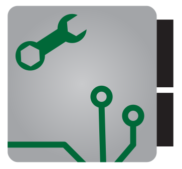

# ECU Explorer

  

A community-driven monorepo for ROM analysis, real-time ECU telemetry, and calibration tuning across Mitsubishi, Subaru, and future vehicle platforms. Featuring a VS Code extension UI, modular protocol support, and LLM-ready MCP tools.

---

**Want to tune your car?**
- 🚗 **[Supported Vehicles & Protocols](PROTOCOL_SUPPORT.md)** — See what works with your vehicle
- 📊 **[Real-Time Logging Guide](REAL_TIME_LOGGING.md)** — Monitor live engine/transmission data
- 🔌 **[Transport Layers](TRANSPORT_LAYERS.md)** — USB, K-line, and CAN hardware details
- 📋 **[Feature Matrix](FEATURES.md)** — Compare capabilities across platforms

**Want to contribute?**
- See the [`CONTRIBUTING.md`](CONTRIBUTING.md) guide for how to get involved
- Check [`DEVELOPMENT.md`](DEVELOPMENT.md) for architecture and roadmap
- Read [`AGENTS.md`](AGENTS.md) for development rules and patterns

---

## Getting Started

Check out the available apps:

| App | Description |
|-----|-------------|
| [**VS Code Extension**](./apps/vscode/) | ROM editing, real-time logging, and MCP tools within Visual Studio Code |

## Quick-Reference Capability Matrix

| Vehicle | Protocol | ROM Read | ROM Write | Live Data | Transport | Status |
|---------|----------|:--------:|:---------:|:---------:|-----------|--------|
| **Mitsubishi EVO X (4B11T)** | MUT-III | ✅ | ❌* | ⏳ | CAN (OpenPort 2.0) | Partial |
| **Mitsubishi EVO X (Bootloader)** | UDS/Bootloader | ✅ | ✅ | ❌ | CAN (OpenPort 2.0) | Ready |
| **Subaru WRX/STI/Forester** | KWP2000 | ✅ | ✅ | ⏳** | CAN (OpenPort 2.0) | Partial |
| **Nissan (older)** | NCS K-line | ❌ | ❌ | ❌ | K-line (future) | Not Started |
| **OBD-II (any)** | ISO 14229 | ❌ | ❌ | ✅ | CAN (OpenPort 2.0) | Ready |

**Legend**: ✅ = Complete, ⏳ = In Progress, ❌ = Not Started, ❌* = Blocked on security key, ❌** = Requires K-line hardware

---

## Features

See [FEATURES.md](FEATURES.md) for a detailed features list.

## Supported Vehicles & ECUs

See **[PROTOCOL_SUPPORT.md](PROTOCOL_SUPPORT.md)** for detailed per-vehicle capabilities.

### Current Focus

- **Mitsubishi EVO X / 4B11T** — Complete ROM editing + tuning
- **Subaru WRX/STI/Forester (Denso SH7058 ECU)** — Complete ROM editing
- **Generic OBD-II** — Real-time monitoring (8 standard PIDs)

---

## Contributing

Contributions are welcome! Please:

1. **Read the specs** — Check [`specs/`](specs/) for feature details and acceptance criteria
2. **Write tests** — Aim for ≥80% coverage; use existing test patterns
3. **Update docs** — JSDoc comments, README updates, spec references
4. **Follow patterns** — Use existing code patterns; check [`AGENTS.md`](AGENTS.md) for guidelines
5. **Test locally** — Run `npm run test:coverage` before submitting

---

## Disclaimer

This project is **reverse-engineered** from existing tools and ECU communication analysis. No licensed, proprietary, or copyrighted code is included. All work is validated through extensive testing (1000+ unit and integration tests) and code review.

**A large portion of this project—core logic, reverse engineering, documentation, and testing—is provided by AI** and validated by humans for accuracy and consistency.

**AI-generated feature PRs are welcome** if they:

- Include comprehensive tests and documentation
- Are reviewed by a human
- Meet existing CI/code quality standards

For questions about scope or expectations, open an issue or discussion.

---

## Resources

- **EcuFlash**: https://www.tactrix.com/
- **EvoScan**: https://www.evoscan.com/
- **RomRaider**: https://romraider.com/
- **OpenPort 2.0**: https://github.com/NikolaKozina/j2534
- **Ghido**: https://ghidra-sre.org/
- **Ghidra-MCP**: https://github.com/LaurieWired/GhidraMCP