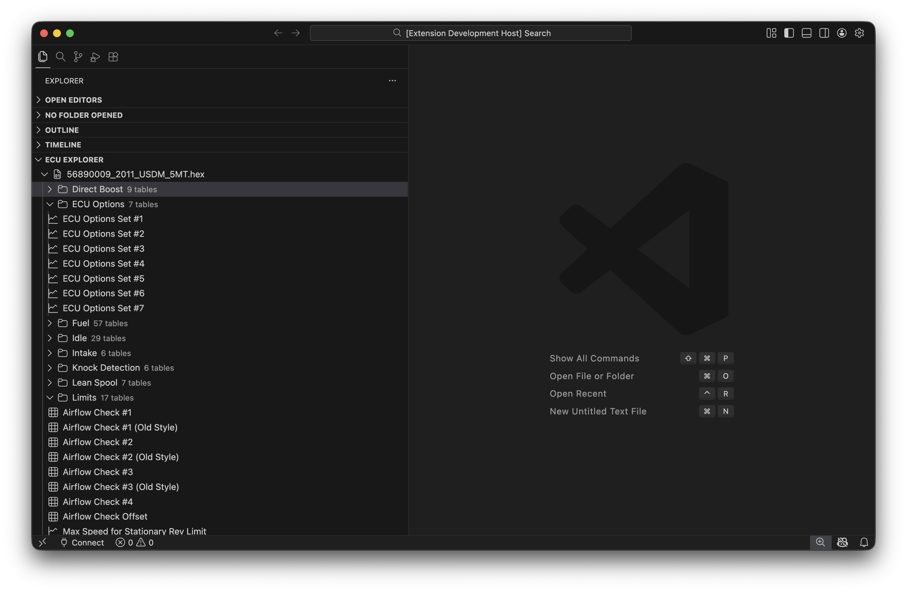
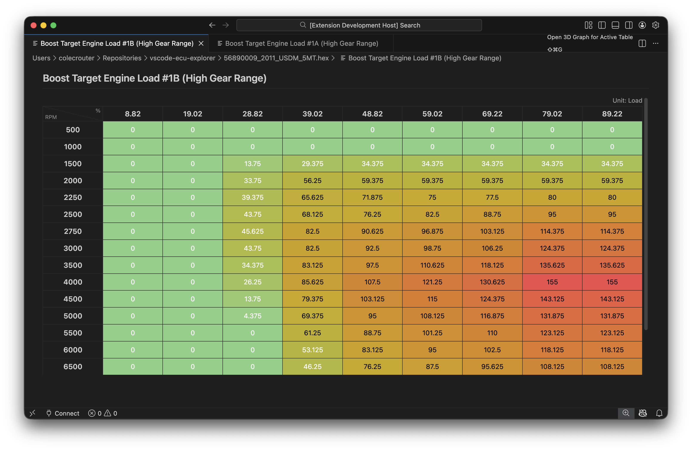
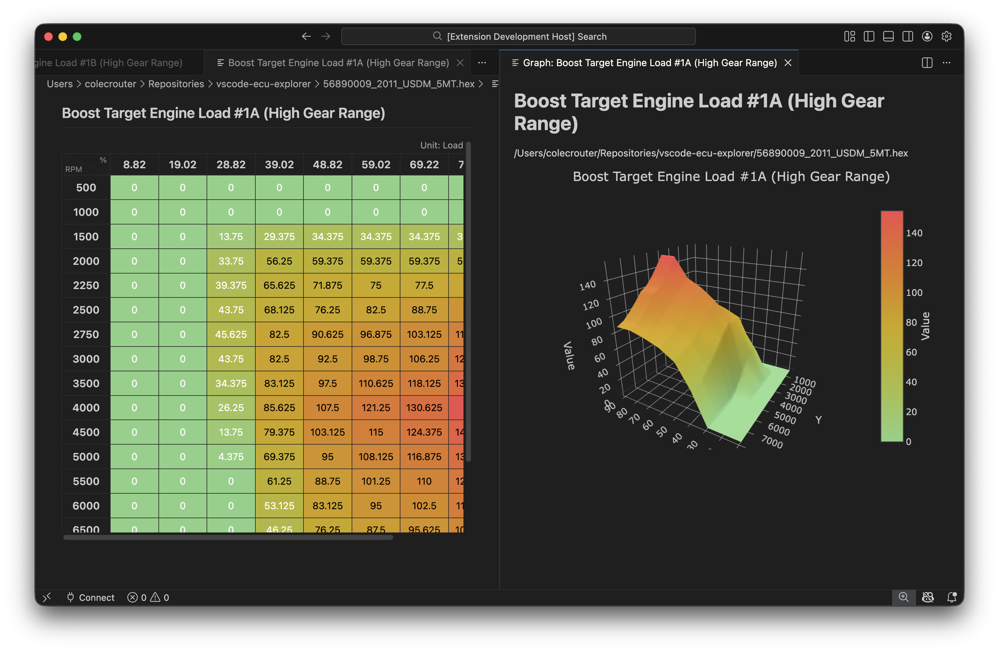
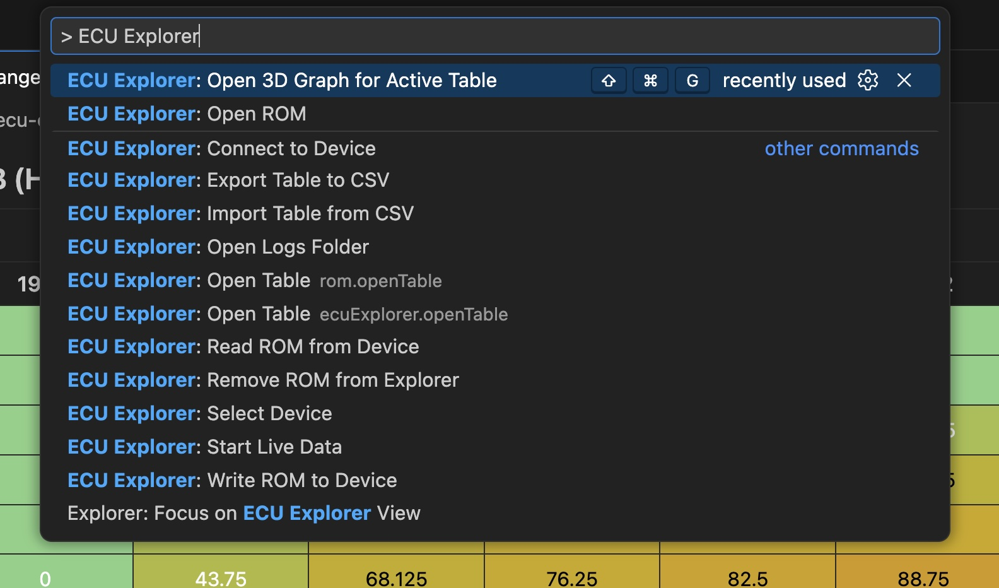
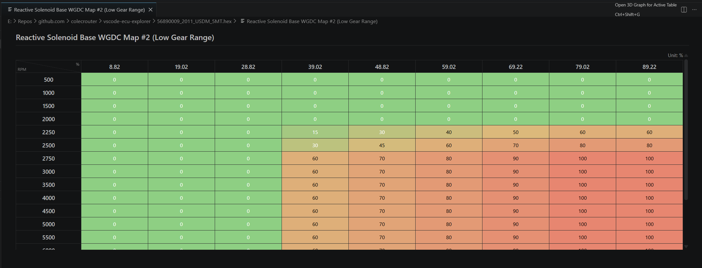

# ECU Explorer - VS Code Extension

<div align="center">
  
</div>

A VS Code extension for ECU ROM analysis, real-time telemetry, and calibration tuning. Built for Mitsubishi, Subaru, and other vehicle platforms with XML definition support.

---

## Overview

ECU Explorer brings professional ECU tuning capabilities directly into VS Code:

- **ROM Analysis** — Open and analyze binary ROM files with automatic definition matching
- **Table Editing** — Edit calibration tables with a full spreadsheet interface
- **Visualization** — View tables as heatmaps and 3D surface plots
- **Real-Time Data** — Stream live engine/transmission data from your vehicle
- **CSV Import/Export** — Roundtrip data with external tools
- **MCP Integration** — AI-powered tools via Model Context Protocol

---

## Installation

1. Open VS Code and go to Extensions (Cmd+Shift+X / Ctrl+Shift+X)
2. Search for "ECU Explorer"
3. Click **Install**

Or install from a local `.vsix` file:

```bash
code --install-extension ecu-explorer.vsix
```

---

## Quick Start

### 1. Open a ROM File

Use **File > Open** (Cmd+O / Ctrl+O) and select a ROM file:
- `.bin`, `.hex`, or `.rom` files

ECU Explorer will automatically match the ROM to a definition from your workspace or configured definition paths.

### 2. Browse Tables

The ECU Explorer view in the sidebar shows all discovered tables. Click any table to open it in the editor.

### 3. Edit Values

Edit cells directly in the table grid. Changes are validated against table constraints and tracked with full undo/redo support.

### 4. Save Changes

Save your modified ROM. Checksums are automatically recomputed on save.

---

## Features

### ROM Explorer Tree View

The ECU Explorer view shows:
- Opened ROM files with metadata (platform, ROM ID, file size)
- Organized table hierarchy (Fuel, Timing, Boost, etc.)
- Quick actions: Open Table, Open 2D Graph, Open 3D Graph

### Table Editor

- Full spreadsheet interface with keyboard navigation
- Multi-cell selection with mouse or Shift+Arrow
- Cell validation with min/max bounds
- Axis labels with units (RPM, kPa, °C, etc.)
- Copy/paste support (TSV format)
- Math operations on selections: Add, Multiply, Clamp, Smooth

### Graph Visualization

- **2D Heatmap** — Color-coded table view for 1D and 2D tables
- **3D Surface** — Interactive 3D plot for 2D tables
- Keyboard shortcut: Cmd+Shift+G / Ctrl+Shift+G

### CSV Import/Export

- Export tables to CSV for analysis in Excel/Numbers
- Import modified CSV files back into the ROM
- Supports 1D, 2D, and 3D table formats

### Real-Time Data Streaming

Connect to a vehicle via OpenPort 2.0 and stream live data:

- **Mitsubishi EVO X**: 48 RAX parameters
- **Subaru**: 100+ SSM/SST parameters
- **Generic OBD-II**: 8 standard PIDs (RPM, speed, temps, etc.)

### MCP Server

The extension includes an MCP server with tools for AI integration:

- `list_tables` — List all tables in a ROM
- `process_table` — Apply operations to tables
- `rom_info` — Get ROM metadata
- `list_logs` — List saved log files
- `query_logs` — Query log data

---

## Supported Vehicles

| Vehicle | ROM Read | ROM Write | Live Data |
|---------|:--------:|:---------:|:---------:|
| Mitsubishi EVO X (4B11T) | ✅ | ✅* | ⏳ |
| Subaru WRX/STI/Forester | ✅ | ✅ | ⏳ |
| Generic OBD-II | — | — | ✅ |

\* *Write via bootloader method; MUT-III write blocked on unknown security key*

---

## Configuration

### Definition Paths

ECU Explorer searches for ROM definitions in:

1. **Workspace folders** — Any open VS Code workspace
2. **Configured paths** — Set via VS Code settings

```json
{
  "ecuExplorer.definitions.paths": ["path/to/definitions"],
  "ecuExplorer.definitions.ecuflash.paths": ["path/to/ecuflash/xmls"]
}
```

### Live Data Settings

```json
{
  "ecuExplorer.logsFolder": "logs",
  "ecuExplorer.logging.columns": "all"
}
```

---

## Commands

| Command | Description | Shortcut |
|---------|-------------|----------|
| `ECU Explorer: Open ROM` | Open a ROM file | — |
| `ECU Explorer: Open Table` | Open a specific table | — |
| `ECU Explorer: Export Table to CSV` | Export table data | — |
| `ECU Explorer: Import Table from CSV` | Import CSV into table | — |
| `Open 2D Graph` | View table as heatmap | Cmd+Shift+G |
| `Open 3D Graph` | View table as 3D surface | Cmd+Shift+G |
| `Select Device` | Choose connected device | — |
| `Connect to Device` | Connect via OpenPort 2.0 | — |
| `Start Live Data` | Begin real-time streaming | — |

---

## Screenshots

### ROM Explorer Tree View



*ECU Explorer sidebar showing ROM with tables organized by category*

### Table Editor (Heatmap View)



*2D table in spreadsheet/heatmap view with axis labels and color-coded cells*

### 3D Surface Plot



*Interactive 3D surface plot of a 2D calibration table*

### Command Palette



*Command palette filtered to ECU Explorer commands*

### Theme-Adaptive Table UI



*Table views and related UI elements automatically adapt to your active VS Code/IDE theme for a consistent editing experience.*

---

## Supported Hardware

| Device | CAN | K-Line | Status |
|--------|-----|--------|--------|
| **Tactrix OpenPort 2.0** | ✅ | ⏳ | Primary device |

See [Transport Layers & Hardware Architecture](../TRANSPORT_LAYERS.md) for detailed hardware compatibility.

---

## Requirements

- **VS Code** 1.99.0 or later
- **Supported USB device** OpenPort 2.0
- **ROM definition files**

---

## Getting Help

- [Quickstart Guide](https://github.com/colecrouter/ecu-explorer/blob/main/apps/vscode/QUICKSTART.md) — Example files and setup
- [Feature Matrix](https://github.com/colecrouter/ecu-explorer/blob/main/FEATURES.md) — Detailed capability comparison
- [Protocol Support](https://github.com/colecrouter/ecu-explorer/blob/main/PROTOCOL_SUPPORT.md) — Vehicle-specific details
- [Real-Time Logging](https://github.com/colecrouter/ecu-explorer/blob/main/REAL_TIME_LOGGING.md) — Live data guide
- [Contributing](https://github.com/colecrouter/ecu-explorer/blob/main/CONTRIBUTING.md) — Development setup

---

## Disclaimer

This extension is for educational and research purposes. Modifying ECU software can affect vehicle performance, emissions, safety, and warranty coverage. Always back up original ROM files and consult your vehicle's manufacturer documentation.

---

## License

GPL-3.0 — See [LICENSE](https://github.com/colecrouter/ecu-explorer/blob/main/LICENSE) for details.
