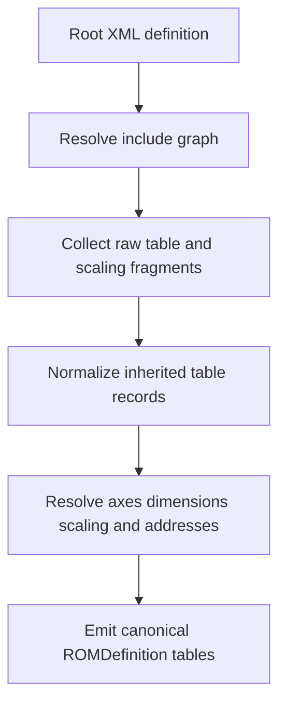

# Inherited Table Normalization Implementation Plan

## Objective

Document the implementation plan for replacing the current heuristic inherited-table parsing path in [`EcuFlashProvider.parse()`](packages/definitions/ecuflash/src/index.ts:800) and [`EcuFlashProvider.parseTablesFromDoc()`](packages/definitions/ecuflash/src/index.ts:1046) with a staged normalization and resolution pipeline that produces canonical inherited table definitions before emission.

## Current Problem Statement

Inherited ECUFlash table parsing still depends on a layered set of heuristics that merge include fragments, template fragments, and local address overrides late in the parse flow. The current strategy works for many fixtures, but it is still structurally vulnerable to inherited multi-axis tables collapsing to `1x1` when any axis metadata is not reconstructed in exactly the expected shape.

Live evidence already exists in regression coverage that was added specifically to guard against this failure mode:

- [`it("regression: Airflow Check #1 inherits axes from included metadata and does not collapse to 1x1")`](packages/definitions/ecuflash/test/ecuflash-provider.test.ts:1230) proves the parser has recently observed or reproduced the inherited collapse behavior for `Airflow Check #1`
- [`it("regression: sparse inherited 3D axes materialize from template metadata when only one local child is present")`](packages/definitions/ecuflash/test/ecuflash-provider.test.ts:1307) captures sparse-child inheritance scenarios that can otherwise under-resolve dimensions
- [`it("regression: same-name included template fragments merge later axis metadata instead of first-wins collapsing inherited tables")`](packages/definitions/ecuflash/test/ecuflash-provider.test.ts:1381) demonstrates same-name fragment merging pressure on inherited axis recovery
- The parser contains dedicated trace scaffolding in [`INHERIT_TRACE_TABLE_NAMES`](packages/definitions/ecuflash/src/index.ts:53) and [`shouldTraceInheritedTable()`](packages/definitions/ecuflash/src/index.ts:55), plus `rows === 1 && cols === 1` tracing hooks in [`parseTablesFromDoc()`](packages/definitions/ecuflash/src/index.ts:1089), [`parseTablesFromDoc()`](packages/definitions/ecuflash/src/index.ts:1117), and [`parseTablesFromDoc()`](packages/definitions/ecuflash/src/index.ts:1175), which is further evidence that inherited tables still need live diagnosis around `1x1` collapse conditions

The core issue is not just a missing edge-case fix. The issue is architectural: inherited tables are emitted before the provider has a single normalized representation for include ancestry, fragment provenance, axis intent, and unresolved metadata.

## Identified Anti-Pattern in the Current Parser

The anti-pattern is heuristic reconstruction of canonical table semantics from partially merged XML nodes.

### Symptoms of the anti-pattern

1. Include loading mixes discovery, graph traversal, raw fragment collection, and semantic merging inside [`EcuFlashProvider.loadIncludes()`](packages/definitions/ecuflash/src/index.ts:866)
2. Structural table merging happens directly on raw XML node shapes in [`mergeInheritedAndLocalTables()`](packages/definitions/ecuflash/src/index.ts:457)
3. Template semantics are partially inferred via [`parseTemplateTable()`](packages/definitions/ecuflash/src/index.ts:560) and [`buildTemplateIndex()`](packages/definitions/ecuflash/src/index.ts:599), then re-interpreted again later by [`buildAxisDefinition()`](packages/definitions/ecuflash/src/index.ts:1185)
4. Axis selection in [`buildAxisDefinition()`](packages/definitions/ecuflash/src/index.ts:1185) relies on a priority cascade of name match, role match, template role match, positional guess, address-bearing child, and fallback child, which is a classic sign that the parser is compensating for absent normalized identity
5. Dimension emission in [`parseTablesFromDoc()`](packages/definitions/ecuflash/src/index.ts:1046) falls back to `1` whenever axis reconstruction fails, rather than distinguishing between scalar truth and unresolved inherited metadata

### Why this is a problem

- It hides unresolved inheritance behind seemingly valid canonical output
- It makes correctness dependent on merge order and incidental fragment shape
- It couples include traversal, normalization, and final emission into one pass
- It makes future fixes additive and heuristic instead of compositional and deterministic

## Short-Term Stabilization Actions

Before the larger refactor, the parser should be stabilized so inherited multi-axis failures become explicit instead of silently emitted as `1x1` tables.

### Immediate actions

1. Remove the silent `1x1` fallback for unresolved inherited multi-axis tables in the 2D and 3D branches of [`parseTablesFromDoc()`](packages/definitions/ecuflash/src/index.ts:1097) and [`parseTablesFromDoc()`](packages/definitions/ecuflash/src/index.ts:1125)
2. Introduce an explicit unresolved-state path for inherited tables that have:
   - a template or included fragment indicating `2D` or `3D`
   - at least one inherited or local child axis fragment
   - insufficient normalized axis metadata to derive dimensions safely
3. Fail loudly for those cases with a descriptive error or structured diagnostic instead of defaulting `rows` or `cols` to `1`
4. Keep trace instrumentation, but move it toward structured diagnostics keyed by table name, include source, fragment provenance, and resolution stage

### Expected stabilization outcome

- Real scalar `1D` tables remain supported
- Truly resolved inherited `2D` and `3D` tables continue to emit normally
- Unresolved inherited multi-axis tables stop masquerading as valid `1x1` definitions
- Regression tests can distinguish real parser support from graceful failure

## Proposed Staged Architecture

The replacement architecture should separate discovery, normalization, resolution, and emission into explicit phases.

### Stage 1: Include Graph Resolution

Goal: resolve the full include graph once and preserve provenance.

#### Responsibilities

- Build a deterministic include graph rooted at the requested definition
- Preserve include order and ancestry from [`EcuFlashProvider.loadIncludes()`](packages/definitions/ecuflash/src/index.ts:866)
- Detect cycles as graph facts, not just visited-node suppression
- Associate every loaded XML file with:
  - resolved filesystem path
  - xmlid if available
  - parent include edge
  - traversal order

#### Deliverable shape

Create an internal graph model such as:

- `DefinitionNode`
- `DefinitionEdge`
- `ResolvedIncludeGraph`

This stage should not merge tables. It should only establish authoritative source ordering and provenance.

### Stage 2: Raw Fragment Collection

Goal: collect table and scaling fragments from each resolved definition file without applying semantic guesses.

#### Responsibilities

- Extract raw table fragments from every included document and the root document
- Extract raw scaling fragments separately
- Preserve fragment provenance:
  - source definition path
  - include depth
  - local fragment order
  - table name if present
  - child fragment position and role hints

#### Deliverable shape

Create normalized raw records such as:

- `RawTableFragment`
- `RawAxisFragment`
- `RawScalingFragment`

Each record should be immutable and provenance-rich. No canonical table should exist yet.

### Stage 3: Normalized Inherited-Table Assembly

Goal: assemble all fragments for a logical table into one normalized intermediate representation before binary table emission.

#### Responsibilities

- Group same-name table fragments across the include graph and root definition
- Preserve precedence rules explicitly instead of relying on object spread and raw child merge heuristics from [`mergeInheritedAndLocalTables()`](packages/definitions/ecuflash/src/index.ts:457)
- Build one normalized table assembly record per logical table with separate slots for:
  - declared table kind intent
  - z payload metadata
  - x axis fragment candidates
  - y axis fragment candidates
  - swapxy intent
  - category and display metadata
  - unresolved conflicts or gaps

#### Assembly rules

- A fragment contributes facts, not final truth
- Conflicting facts are recorded and resolved by explicit precedence rules
- Axis identity is based on normalized role and provenance, not fallback position alone
- Address-only child overrides are treated as partial axis fragments, not complete axis definitions
- Same-name fragments that contribute metadata later in the chain must enrich the assembly record rather than overwrite it destructively

#### Deliverable shape

Create an intermediate model such as:

- `NormalizedTableAssembly`
- `NormalizedAxisAssembly`
- `ResolutionIssue`

This stage is the main replacement for the current template-plus-merge heuristic chain.

### Stage 4: Canonical Resolution and Emission

Goal: convert normalized assembly records into final [`TableDefinition`](packages/core/src/definition/table.ts) values only after all inherited facts are reconciled.

#### Responsibilities

- Resolve scalings against a unified scaling registry
- Resolve axis kind as static or dynamic only after fragment assembly is complete
- Resolve dimensions deterministically from normalized axis records
- Enforce that inherited `3D` and `2D` tables cannot emit as `1x1` unless the source truly defines that shape
- Apply `swapxy` only at canonical emission time
- Emit diagnostics for unresolved assemblies instead of fabricating valid-looking output

#### Emission rules

- If canonical resolution succeeds, emit the final `table1d` or `table2d` record
- If canonical resolution fails for an inherited multi-axis table, surface a typed error or diagnostic and skip emission according to the chosen policy
- Only use dimension `1` when the normalized table intent genuinely corresponds to scalar or single-element data, not as a catch-all fallback

## Testing Strategy

Testing should follow the existing regression-heavy style in [`packages/definitions/ecuflash/test/ecuflash-provider.test.ts`](packages/definitions/ecuflash/test/ecuflash-provider.test.ts) while shifting coverage toward stage boundaries.

### Test categories

1. Include graph tests
   - xmlid resolution
   - parent directory lookup
   - cycle detection
   - deterministic traversal order

2. Raw fragment collection tests
   - fragment provenance capture
   - same-name fragment preservation
   - child axis fragment extraction without premature collapse

3. Normalization tests
   - address-only local child overrides
   - sparse inherited axis cases
   - same-name template fragment enrichment
   - unresolved conflict recording

4. Canonical emission tests
   - resolved inherited `3D` tables emit expected rows and cols
   - unresolved inherited multi-axis tables throw or diagnose instead of emitting `1x1`
   - scalar and legitimate single-element cases still emit correctly
   - `swapxy` still preserves axis identity and matrix layout

### Migration of existing regression tests

Retain and adapt the current regression anchors, especially:

- [`it("regression: local address-only child axes preserve inherited dimensions instead of collapsing to 1x1")`](packages/definitions/ecuflash/test/ecuflash-provider.test.ts:205)
- [`it("regression: inherited address-only child overrides preserve child role/type/scaling metadata from base table")`](packages/definitions/ecuflash/test/ecuflash-provider.test.ts:277)
- [`it("regression: Airflow Check #1 inherits axes from included metadata and does not collapse to 1x1")`](packages/definitions/ecuflash/test/ecuflash-provider.test.ts:1230)
- [`it("regression: sparse inherited 3D axes materialize from template metadata when only one local child is present")`](packages/definitions/ecuflash/test/ecuflash-provider.test.ts:1307)
- [`it("regression: same-name included template fragments merge later axis metadata instead of first-wins collapsing inherited tables")`](packages/definitions/ecuflash/test/ecuflash-provider.test.ts:1381)
- [`it("regression: buildTemplateIndex merges same-name local fragments when later fragment contributes axis metadata")`](packages/definitions/ecuflash/test/ecuflash-provider.test.ts:1467)

### New acceptance criteria for the refactor

- No inherited multi-axis table silently degrades to `1x1`
- Every emitted inherited table is traceable to a normalized assembly record
- Include graph provenance is available in diagnostics
- Axis resolution no longer depends on a last-chance fallback cascade comparable to [`buildAxisDefinition()`](packages/definitions/ecuflash/src/index.ts:1185)

## Migration Strategy

The refactor should be introduced incrementally rather than as a single parser rewrite.

### Migration principles

- Keep public provider API stable through [`EcuFlashProvider.parse()`](packages/definitions/ecuflash/src/index.ts:800)
- Introduce internal staged models beside the current parser first
- Migrate one responsibility at a time behind focused tests
- Remove old heuristic code only after the new stage owns the behavior fully

### Suggested migration path

1. Add graph and fragment models without changing final output
2. Add normalized table assembly alongside current merge/template logic for comparison
3. Gate canonical emission on normalized assemblies for inherited multi-axis tables first
4. Remove silent fallback behavior
5. Retire obsolete helpers once their responsibilities are replaced, including large parts of:
   - [`mergeInheritedAndLocalTables()`](packages/definitions/ecuflash/src/index.ts:457)
   - [`parseTemplateTable()`](packages/definitions/ecuflash/src/index.ts:560)
   - [`buildTemplateIndex()`](packages/definitions/ecuflash/src/index.ts:599)
   - heuristic portions of [`buildAxisDefinition()`](packages/definitions/ecuflash/src/index.ts:1185)

## Milestone Sequencing

### Milestone 1: Stabilize Failure Semantics

- Remove silent `1x1` fallback for unresolved inherited multi-axis tables
- Add explicit diagnostics for unresolved inherited axis metadata
- Preserve existing passing behavior for already resolved fixtures

### Milestone 2: Introduce Include Graph Model

- Extract include graph resolution from [`EcuFlashProvider.loadIncludes()`](packages/definitions/ecuflash/src/index.ts:866)
- Persist provenance and deterministic traversal order
- Add graph-focused tests

### Milestone 3: Introduce Raw Fragment Collection

- Collect table and scaling fragments without merging
- Preserve same-name fragments and child fragment provenance
- Add fragment collection tests

### Milestone 4: Build Normalized Assembly Layer

- Introduce normalized table and axis assembly records
- Replace destructive raw-node merging with explicit precedence logic
- Add normalization tests for sparse and address-only inherited cases

### Milestone 5: Switch Canonical Emission to Normalized Assemblies

- Emit final table definitions from normalized assembly records
- Preserve `swapxy`, scaling, and axis typing semantics
- Remove legacy fallback-driven emission paths

### Milestone 6: Cleanup and Hardening

- Remove obsolete heuristic helpers
- Simplify parser flow and diagnostics
- Expand regression coverage around inherited Tephra tables and other include-heavy definitions

## Implementation Notes for the Follow-On Coding Phase

- Keep the plan focused on internal parser architecture and avoid changing provider-facing contracts unless forced by diagnostics design
- Prefer stage-specific pure helpers over monolithic methods
- Ensure all new internal models encode provenance explicitly so future debugging does not require special-case trace hooks like [`shouldTraceInheritedTable()`](packages/definitions/ecuflash/src/index.ts:55)
- Use existing repository testing guidance from [`CONTRIBUTING.md`](CONTRIBUTING.md) and the provider architecture context in [`ARCHITECTURE.md`](ARCHITECTURE.md)

## Proposed Todo Sequence for Implementation Mode

- Add unresolved inherited multi-axis diagnostics and remove silent `1x1` fallback
- Extract include graph resolution into a dedicated internal stage model
- Add raw fragment collection for tables, axes, and scalings with provenance
- Implement normalized inherited-table assembly records and precedence rules
- Switch canonical table emission to normalized assemblies
- Update and expand provider regression tests for inherited Tephra tables
- Remove obsolete heuristic merging helpers and trace scaffolding that the staged pipeline supersedes
