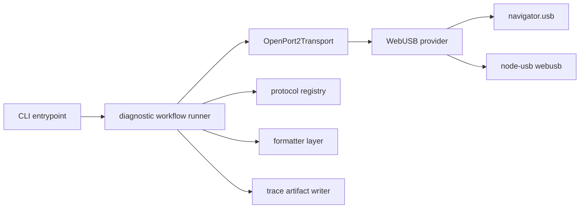

# Device diagnostics CLI implementation plan

## Goal

Build a CLI-based device diagnostics utility that closely follows the VSCode device workflow for connect, probe, logging, and ROM-read diagnostics, while reusing output conventions already established by [`inspect-rom.js`](../packages/tools/inspect-rom.js) and formatter helpers in [`packages/mcp/src/formatters/`](../packages/mcp/src/formatters/).

## Scope

The first version should provide a debugging utility that can:

- enumerate compatible OpenPort 2.0 devices
- connect to a selected device using the same transport implementation used by the extension
- initialize the transport and probe protocols
- run focused diagnostic operations such as connect-only, protocol probe, logging probe, and read-ROM dry run
- emit YAML frontmatter plus markdown-style output similar to the existing ROM inspection tool
- optionally emit structured trace artifacts for deeper debugging

## Guiding decisions

### Reuse the existing transport implementation

Use dependency injection around the WebUSB provider in [`OpenPort2Transport`](../packages/device/transports/openport2/src/index.ts) rather than building a second transport stack.

Target runtime split:

- VSCode or browser runtime uses `navigator.usb`
- CLI runtime uses the `webusb` export from `node-usb`
- tests use a fake WebUSB-compatible provider

### Runtime fallback for OpenPort ownership conflicts

When running on macOS or other systems where the OpenPort USB interface is already claimed by a kernel driver, the transport should fall back to WebHID when available.

Behavior:
- Attempt WebUSB/open path first for the normal flow.
- If `connect()` cannot claim the interface through USB, continue with the same device lookup through WebHID.
- This preserves CLI diagnostics and protocol probing in environments where bulk USB claim is blocked without requiring manual driver swaps for every run.
- If neither path works, surface the original USB claim failure to preserve actionable error context.

### Reuse existing output patterns

The diagnostics tool should feel like a sibling of [`inspect-rom.js`](../packages/tools/inspect-rom.js), not a one-off debugging script.

Target presentation style:

- YAML frontmatter for top-level metadata
- markdown sections for readable step-by-step summaries
- formatter reuse from existing MCP formatter modules where practical

### Prefer shared workflow logic over CLI-only logic

The staged diagnostic flow should live in a reusable module so it can later be reused by a VSCode command such as a device diagnostics command.

### Capture first, replay later

The first version should produce structured trace artifacts that are useful immediately. Replay support can be added later once capture format stabilizes.

## User flows and subcommands

Initial commands should answer concrete debugging questions.

### `device-inspect list`

Answers: does the transport see the device at all?

### `device-inspect connect`

Answers: can the device open, claim interface, and initialize successfully?

### `device-inspect probe`

Answers: which protocol succeeds or fails during [`canHandle()`](../packages/device/src/index.ts)?

### `device-inspect log --duration <n>`

Answers: can a live data session start and remain healthy briefly?

### `device-inspect read-rom --dry-run`

Answers: can the read path negotiate correctly without requiring a full successful ROM workflow?

## Planned architecture

## Implementation steps

### 1. Refactor WebUSB access in [`OpenPort2Transport`](../packages/device/transports/openport2/src/index.ts)

Make the smallest viable change so the transport no longer hardcodes `navigator.usb` internally.

Implementation target:

- inject a WebUSB-like provider into the transport constructor
- default to `navigator.usb` when running in the existing runtime
- allow CLI code to pass in `node-usb`’s WebUSB-compatible object
- allow tests to pass a fake provider

This should affect methods currently tied to browser globals:

- [`listDevices()`](../packages/device/transports/openport2/src/index.ts)
- [`requestDevice()`](../packages/device/transports/openport2/src/index.ts)
- [`connect()`](../packages/device/transports/openport2/src/index.ts)

### 2. Add transport-level tests for the injected WebUSB provider

Add focused tests around the OpenPort transport behavior using a fake provider.

Test targets:

- enumerates and filters matching VID and PID devices
- returns no devices when none match
- connects to the selected device ID
- errors cleanly when device is missing
- exercises read and write behavior through the existing connection methods

### 3. Create a shared diagnostic workflow runner

Add a reusable module that performs staged device diagnostics independent of CLI output formatting.

Responsibilities:

- enumerate devices from the transport
- select a device by explicit ID or first available device
- connect and initialize the transport
- probe registered protocols through [`canHandle()`](../packages/device/src/index.ts)
- run optional operation stages such as logging probe or ROM-read dry run
- emit structured step events throughout the flow

Possible placement:

- under `packages/device/src/`
- or another shared package if that location better matches future reuse

### 4. Define the diagnostic event model

Use a consistent set of diagnostic events so both CLI output and trace artifacts are based on the same source data.

Suggested event types:

- `transport.enumerate.start`
- `transport.enumerate.success`
- `transport.connect.start`
- `transport.connect.success`
- `transport.initialize.start`
- `transport.initialize.success`
- `protocol.probe.start`
- `protocol.probe.success`
- `protocol.probe.failure`
- `operation.start`
- `operation.success`
- `operation.failure`
- `raw.transfer.out`
- `raw.transfer.in`

Each event should include:

- timestamp
- stage or event type
- status
- duration when available
- human summary text
- optional machine-readable payload

### 5. Reuse formatter conventions from the existing tool chain

Create or extend formatter helpers so the diagnostics tool produces text in the same family as [`inspect-rom.js`](../packages/tools/inspect-rom.js).

Recommended output structure:

- YAML frontmatter for summary metadata
- markdown body for readable step-by-step results

Suggested frontmatter fields:

- `tool`
- `command`
- `device`
- `transport`
- `protocol`
- `status`
- `trace_file`

Potential formatter touchpoints:

- [`packages/mcp/src/formatters/yaml-formatter.ts`](../packages/mcp/src/formatters/yaml-formatter.ts)
- new diagnostics formatter alongside existing formatter modules

### 6. Add trace and raw frame capture support

To make the tool genuinely useful for field debugging, tracing should be first-class and opt-in.

Suggested CLI flags:

- `--verbose`
- `--raw`
- `--trace-file <path>`

Trace capture targets:

- initialization command flow
- raw transfer out payloads
- raw transfer in payloads
- decoded textual responses when relevant
- protocol probe outcomes
- logging frames and health events when running a log probe

### 7. Emit structured artifacts in a replay-friendly format

Even if replay support is deferred, store trace output in a format that supports later playback and comparison.

Recommended initial format:

- JSON Lines for ordered events
- optional hex-encoded raw payload fields

Benefits:

- easy to archive failing sessions
- easy to diff good versus bad runs
- good foundation for later replay adapters or regression fixtures

### 8. Add a new CLI tool in [`packages/tools/`](../packages/tools/)

Create a new tool file, likely [`packages/tools/inspect-device.js`](../packages/tools/inspect-device.js), using the same `sade`-based style as [`inspect-rom.js`](../packages/tools/inspect-rom.js).

Responsibilities:

- parse commands and flags
- construct the OpenPort transport using the Node WebUSB provider
- register protocols needed for probing
- invoke the shared diagnostic workflow runner
- render human-readable output using the shared formatter approach
- optionally write trace artifacts to disk

Also update script registrations in:

- [`packages/tools/package.json`](../packages/tools/package.json)
- [`package.json`](../package.json)

Use the existing `tools:` naming convention described in [`AGENTS.md`](../AGENTS.md).

### 9. Add workflow and formatter tests

Test the shared workflow separately from the transport and separately from the CLI argument parser.

Workflow tests should cover:

- successful connect-only diagnostics
- protocol probing finds the first matching protocol
- probe failure across all protocols is summarized cleanly
- operation failures report the correct failing stage

Formatter tests should cover:

- YAML frontmatter stability
- markdown section structure
- inclusion of trace file references when enabled
- consistency with existing tool output conventions

### 10. Sequence implementation to reduce risk

Recommended implementation order:

1. inject WebUSB provider into [`OpenPort2Transport`](../packages/device/transports/openport2/src/index.ts)
2. add unit tests for the transport with a fake provider
3. create the diagnostic workflow runner and event model
4. add diagnostics formatter support with YAML and markdown output
5. implement [`inspect-device.js`](../packages/tools/inspect-device.js)
6. add trace-file output
7. add workflow and formatter tests
8. optionally add future VSCode integration after the CLI path is proven

## Expected file touchpoints

Likely files to modify or add:

- [`packages/device/transports/openport2/src/index.ts`](../packages/device/transports/openport2/src/index.ts)
- new transport tests under `packages/device/transports/openport2/test/`
- new shared diagnostic workflow module under `packages/device/src/`
- new or extended formatter module under [`packages/mcp/src/formatters/`](../packages/mcp/src/formatters/)
- [`packages/tools/inspect-device.js`](../packages/tools/inspect-device.js)
- [`packages/tools/package.json`](../packages/tools/package.json)
- [`package.json`](../package.json)
- any associated test files for CLI or workflow validation

## Definition of done for the first implementation

The first version should be considered complete when it can:

- enumerate OpenPort-compatible devices from a Node CLI using injected WebUSB provider access
- perform a real connect and protocol-probe flow using the same transport implementation as the extension
- print YAML and markdown output consistent with the style of [`inspect-rom.js`](../packages/tools/inspect-rom.js)
- optionally write structured trace artifacts including raw transfers
- report failures in a way that clearly identifies whether the issue occurred during enumeration, connect, initialization, protocol probing, or a higher-level operation

## Follow-up opportunities

Once the core debugging CLI is in place, follow-on work could add:

- transcript replay support
- a VSCode command that runs the same diagnostic workflow
- known-good versus known-bad trace comparison helpers
- support for additional transports beyond OpenPort 2.0
