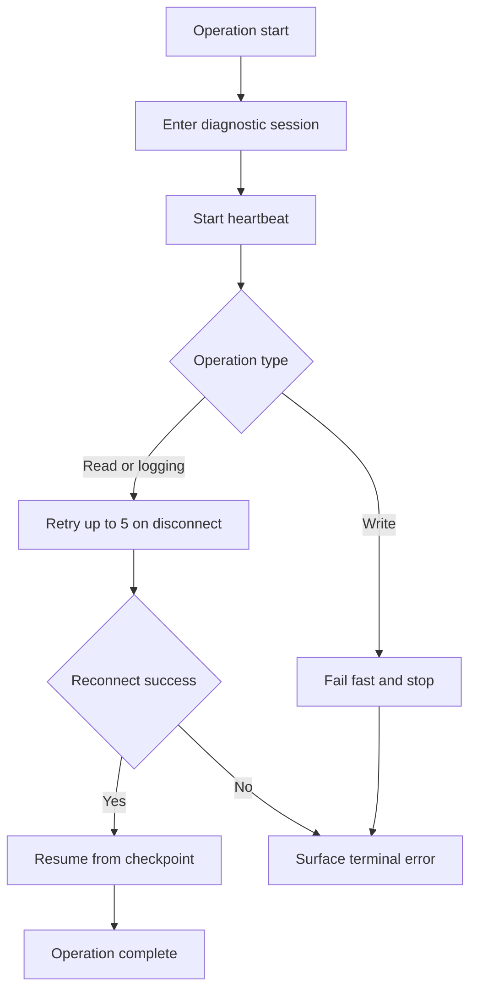

# Device Reliability Plan for Heartbeat Reset Reconnect and Error Recovery

## Objective

Implement robust handling for:

- USB device replug events
- ECU disconnect events
- Generic runtime errors during read write and live logging
- UDS heartbeat via TesterPresent
- UDS reset via ECUReset

Policy baseline:

- Read and logging operations use retry with max 5 attempts
- Write operations fail fast on transport or session loss and require explicit restart

## Scope

In scope:

- [`packages/device/protocols/uds/src/services.ts`](packages/device/protocols/uds/src/services.ts)
- [`packages/device/protocols/uds/src/index.ts`](packages/device/protocols/uds/src/index.ts)
- [`packages/device/transports/openport2/src/index.ts`](packages/device/transports/openport2/src/index.ts)
- [`packages/device/transports/kline/src/kline-transport.ts`](packages/device/transports/kline/src/kline-transport.ts)
- [`apps/vscode/src/device-manager.ts`](apps/vscode/src/device-manager.ts)
- [`apps/vscode/src/extension.ts`](apps/vscode/src/extension.ts)
- test files in [`packages/device/protocols/uds/test`](packages/device/protocols/uds/test) and [`apps/vscode/test`](apps/vscode/test)

Out of scope:

- safety rollout flags
- staged launch controls

## Work Breakdown

1. Define typed connection lifecycle and failure causes
2. Add UDS heartbeat lifecycle manager
3. Add UDS reset command lifecycle
4. Add reconnect orchestration in device manager
5. Add operation resilience rules for read logging and write
6. Add UI status and actionable notifications
7. Add telemetry and structured diagnostics events
8. Add unit integration and transcript driven tests
9. Update documentation

## Architecture Flow

## Detailed Implementation Steps

### Step 1 Connection Lifecycle and Failure Model

Create shared types for state and cause classification:

- states: connected degraded reconnecting resetting failed
- causes: USB_DISCONNECT ECU_TIMEOUT HEARTBEAT_TIMEOUT PROTOCOL_NEGATIVE_RESPONSE TRANSPORT_ERROR unknown

Primary location:

- [`apps/vscode/src/device-manager.ts`](apps/vscode/src/device-manager.ts)

### Step 2 UDS Heartbeat

Implement heartbeat in [`UdsProtocol`](packages/device/protocols/uds/src/index.ts):

- send [`UDS_SERVICES.TESTER_PRESENT`](packages/device/protocols/uds/src/services.ts:12) with subfunction 0x00 on interval
- default interval 2000 ms
- degraded threshold after 3 consecutive misses
- terminal failure when retry budget exhausted
- start after successful session and security entry
- stop in finally blocks for read write and abort paths

### Step 3 UDS Reset

Implement reset API in [`UdsProtocol`](packages/device/protocols/uds/src/index.ts):

- send [`UDS_SERVICES.ECU_RESET`](packages/device/protocols/uds/src/services.ts:9) with explicit reset subtype
- verify positive response and classify expected temporary disconnect
- reconnect then re establish session and security state

### Step 4 Transport Disconnect and Reconnect Hooks

OpenPort2:

- surface stream and transfer failures as typed disconnect events from [`OpenPort2Connection`](packages/device/transports/openport2/src/index.ts:48)
- add connect and disconnect signal path consumable by manager

K line:

- preserve internal retries in [`KLineConnection.sendFrame()`](packages/device/transports/kline/src/kline-transport.ts:74)
- expose terminal failure cause after max retries

### Step 5 DeviceManager Reconnect Orchestration

Add orchestration in [`DeviceManagerImpl`](apps/vscode/src/device-manager.ts:24):

- `reconnectActiveConnection` with max attempts 5 for read logging class operations
- exponential backoff with jitter
- cancellation support
- event emission for state changes and attempt counters

### Step 6 Operation Specific Resilience Rules

Read ROM:

- checkpoint by block index
- on reconnect resume from next unread block

Live logging:

- restart poll loop
- preserve dropped frame counters and reconnect counters

Write ROM:

- on disconnect or missed heartbeat fail immediately
- require explicit user initiated restart from clean write session

### Step 7 Extension UI and User Feedback

Update command flows in [`apps/vscode/src/extension.ts`](apps/vscode/src/extension.ts):

- status messages for degraded reconnecting recovered failed
- include reason and retry count in failures
- distinguish write fail fast from read auto recovery behavior

### Step 8 Telemetry and Diagnostics

Emit structured events:

- HEARTBEAT_STARTED HEARTBEAT_MISSED HEARTBEAT_RESTORED HEARTBEAT_STOPPED
- ECU_RESET_REQUESTED ECU_RESET_ACKNOWLEDGED ECU_RESET_RECONNECTED ECU_RESET_FAILED
- RECONNECT_ATTEMPT RECONNECT_SUCCESS RECONNECT_FAILED
- OPERATION_RESUMED OPERATION_ABORTED

### Step 9 Tests

Unit tests:

- heartbeat scheduler and miss counters
- reset response handling
- reconnect policy selection by operation class

Integration tests:

- usb replug simulation during read logging write
- ecu disconnect simulation during each operation

Transcript driven tests:

- deterministic sequence for resume on read
- deterministic terminal stop on write

### Step 10 Documentation Updates

Update:

- [`DEVELOPMENT.md`](DEVELOPMENT.md)
- [`TRANSPORT_LAYERS.md`](TRANSPORT_LAYERS.md)
- [`PROTOCOL_SUPPORT.md`](PROTOCOL_SUPPORT.md)

## Definition of Done

- heartbeat active during UDS sessions and cleaned up reliably
- reset API implemented and reconnect path verified
- read and logging recover up to 5 retries with resume
- write fails fast on session or transport loss
- manager and UI show clear state transitions and failure causes
- tests cover all target failure paths and pass

