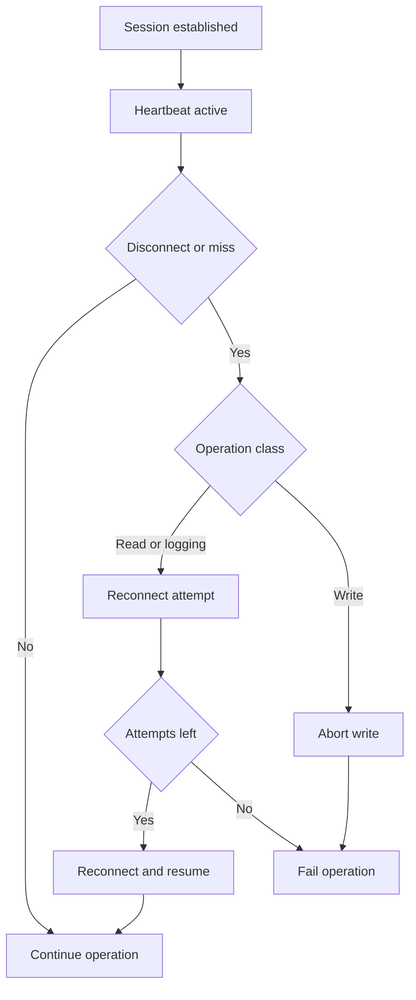

# Device Reliability Spec for Heartbeat Reset Reconnect and Error Recovery

## Summary

This spec defines required behavior for reliability across transport and protocol layers, including:

- USB replug handling
- ECU disconnect handling
- generic runtime error handling
- UDS heartbeat via TesterPresent
- UDS reset via ECUReset

Baseline policy:

- Read and live logging operations use up to 5 reconnect attempts
- Write operations fail fast on session or transport loss

## Problem Statement

Current behavior in [`apps/vscode/src/device-manager.ts`](apps/vscode/src/device-manager.ts), [`packages/device/transports/openport2/src/index.ts`](packages/device/transports/openport2/src/index.ts), and [`packages/device/protocols/uds/src/index.ts`](packages/device/protocols/uds/src/index.ts) lacks a unified lifecycle for reconnect and recovery. Errors are often surfaced but recovery is not consistently orchestrated.

## Goals

1. Add deterministic heartbeat lifecycle for UDS sessions
2. Add deterministic reset lifecycle and post-reset reconnection
3. Unify disconnect detection and reconnect orchestration
4. Preserve safe write semantics with fail-fast behavior
5. Provide consistent UX and diagnostics for all failure classes

## Non Goals

- staged rollout mechanisms
- feature flag gates
- automatic write resume after disconnect

## Functional Requirements

### FR1 Connection State Model

The system SHALL expose connection state transitions:

- connected
- degraded
- reconnecting
- resetting
- failed

The system SHALL classify failure causes:

- usb_disconnect
- ECU_DISCONNECT
- HEARTBEAT_TIMEOUT
- PROTOCOL_NEGATIVE_RESPONSE
- transport_error
- unknown

### FR2 Heartbeat Lifecycle

During active UDS read write and live diagnostic sessions:

- system SHALL send [`UDS_SERVICES.TESTER_PRESENT`](packages/device/protocols/uds/src/services.ts:12) with subfunction 0x00 on interval
- default interval SHALL be configurable with default 2000 ms
- 3 consecutive misses SHALL mark connection degraded
- degraded state SHALL trigger reconnect policy based on operation class
- heartbeat SHALL stop on operation completion cancellation or terminal failure

### FR3 Reset Lifecycle

System SHALL expose ECU reset API using [`UDS_SERVICES.ECU_RESET`](packages/device/protocols/uds/src/services.ts:9):

- send reset subtype explicitly
- validate positive response
- handle temporary disconnect as expected reset behavior
- reconnect and re-establish diagnostic session plus security access before declaring reset complete

### FR4 Reconnect Policy by Operation Class

Read ROM and live logging:

- up to 5 reconnect attempts
- exponential backoff with jitter
- resume from operation checkpoint when possible

Write ROM:

- no automatic reconnect resume after session loss
- fail immediately and surface explicit operator action required

### FR5 Operation Checkpoints

Read ROM:

- checkpoint by block index
- after reconnect resume from next unread block

Live logging:

- restart stream loop after reconnect
- preserve dropped frame and reconnect counters

Write ROM:

- no auto checkpoint resume across disconnect

### FR6 UX Behavior

UI in [`apps/vscode/src/extension.ts`](apps/vscode/src/extension.ts) SHALL:

- show state transitions connected degraded reconnecting recovered failed
- show retry counters for read and logging recoveries
- show clear fail-fast message on write disconnect

### FR7 Diagnostics and Telemetry

System SHALL emit structured events:

- heartbeat_started -> HEARTBEAT_STARTED
- heartbeat_missed -> HEARTBEAT_MISSED
- heartbeat_restored -> HEARTBEAT_RESTORED
- heartbeat_stopped -> HEARTBEAT_STOPPED
- ecu_reset_requested -> ECU_RESET_REQUESTED
- ecu_reset_acknowledged -> ECU_RESET_ACKNOWLEDGED
- ecu_reset_reconnected -> ECU_RESET_RECONNECTED
- ecu_reset_failed -> ECU_RESET_FAILED
- reconnect_attempt -> RECONNECT_ATTEMPT
- reconnect_success -> RECONNECT_SUCCESS
- reconnect_failed -> RECONNECT_FAILED
- operation_resumed -> OPERATION_RESUMED
- operation_aborted -> OPERATION_ABORTED

## Error Handling Rules

1. Negative UDS response SHALL preserve parsed NRC context from [`parseNegativeResponse()`](packages/device/protocols/uds/src/index.ts:27)
2. Transport errors during write SHALL terminate operation immediately
3. Transport errors during read logging SHALL enter retry loop up to 5 attempts
4. Retry exhaustion SHALL transition state to failed and emit terminal diagnostic event

## Mermaid Flow

## Acceptance Criteria

1. Heartbeat starts and stops correctly around UDS session activity
2. Heartbeat miss threshold transitions to degraded and invokes recovery path
3. ECU reset command executes and reconnect path restores usable session
4. Read ROM resumes after simulated disconnect within 5 retries
5. Live logging resumes after simulated disconnect within 5 retries
6. Write ROM disconnect aborts immediately with explicit error
7. UI displays distinct messages for recovery and fail-fast cases
8. Structured diagnostics include retry counts and terminal cause
9. Test suite includes unit integration and transcript-driven coverage of all paths

## Test Requirements

Unit tests in relevant package test directories SHALL cover:

- heartbeat scheduler and miss counter behavior
- reconnect policy selector by operation class
- reset command response handling

Integration and transcript-driven tests SHALL cover:

- usb replug during read
- ecu disconnect during live logging
- disconnect during write producing fail-fast abort

## Implementation References

- Plan: [`plans/device-reliability-heartbeat-reset-plan.md`](plans/device-reliability-heartbeat-reset-plan.md)
- UDS services: [`packages/device/protocols/uds/src/services.ts`](packages/device/protocols/uds/src/services.ts)
- UDS protocol: [`packages/device/protocols/uds/src/index.ts`](packages/device/protocols/uds/src/index.ts)
- Device manager: [`apps/vscode/src/device-manager.ts`](apps/vscode/src/device-manager.ts)
- Extension command and UX flow: [`apps/vscode/src/extension.ts`](apps/vscode/src/extension.ts)

