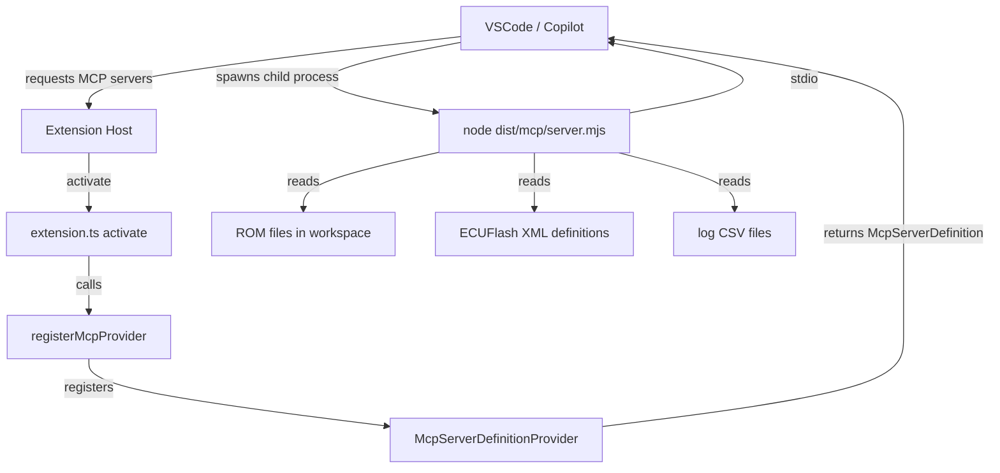

# MCP Server → VSCode Extension Integration Spec

**Reference**: [Adding an MCP Server to a VS Code Extension](https://www.kenmuse.com/blog/adding-mcp-server-to-vs-code-extension/)

---

## 1. Current State Analysis

### 1.1 `packages/mcp` — What Exists

The MCP package is a fully functional, standalone MCP server. Key facts:

| Aspect | Details |
|--------|---------|
| SDK | `@modelcontextprotocol/sdk@^1.12.1` (already a dependency) |
| Transport | `StdioServerTransport` — correct for a process-based server |
| Entry point | `packages/mcp/src/index.ts` — has `#!/usr/bin/env node` shebang |
| Build output | `tsc` → `packages/mcp/dist/index.js` (ESM, `.js` extension) |
| Tools implemented | `list_tables`, `read_table`, `patch_table`, `rom_info`, `list_logs`, `query_logs` |
| Config | `loadConfig()` reads CLI args, `ECU_DEFINITIONS_PATH` env var, `ECU_LOGS_DIR` env var, and `.vscode/settings.json` |

**Problem for VSCode bundling**: The MCP package currently builds via `tsc` into `packages/mcp/dist/`. This produces many individual `.js` files with Node `import()` resolution. For bundling into the extension, we need a **single self-contained `.mjs` file** (or `.cjs`) that Vite/rollup can produce.

### 1.2 `apps/vscode` — Current Build Setup

| Aspect | Details |
|--------|---------|
| Build tool | Vite (rolldown-vite fork) with SSR mode |
| Extension output | `dist/extension.cjs` — CommonJS bundle |
| Webview output | `dist/webview/` — separate Vite config |
| VSCode API version | `^1.75.0` (too old for `mcpServerDefinitionProviders` — needs upgrade) |
| MCP-related code | None currently |

### 1.3 VSCode MCP API Requirements

According to the [kenmuse.com blog post](https://www.kenmuse.com/blog/adding-mcp-server-to-vs-code-extension/), the integration requires:

1. **`package.json` `contributes.mcpServerDefinitionProviders`** — declares the extension provides an MCP server definition
2. **`vscode.lm.registerMcpServerDefinitionProvider()`** — registers a provider that returns the server's launch command
3. **`vscode.McpServerDefinition`** — uses `resolvedMcpServer` with a command pointing to the bundled server script
4. The bundled server script must be an **`.mjs`** (ESM) file because VSCode spawns it with `node --experimental-vm-modules` or similar, expecting ES modules
5. Minimum VSCode engine version: **`^1.99.0`** (MCP APIs landed in 1.99)

---

## 2. Files to Create or Modify

### 2.1 New Files

| File | Purpose |
|------|---------|
| `apps/vscode/src/mcp-provider.ts` | New module: registers `McpServerDefinitionProvider` |
| `apps/vscode/vite.mcp.config.ts` | Vite config producing `dist/mcp/server.mjs` |

### 2.2 Modified Files

| File | Changes Needed |
|------|---------------|
| `apps/vscode/package.json` | Bump engine, add `mcpServerDefinitionProviders`, add `@repo/mcp` dependency |
| `apps/vscode/src/extension.ts` | Import and call `registerMcpProvider(ctx)` inside `activate()` |
| `apps/vscode/vite.config.ts` | No change needed (extension bundle stays separate) |

---

## 3. Detailed Changes

### 3.1 `apps/vscode/package.json`

#### 3.1.1 Bump `engines.vscode`

```json
"engines": {
  "vscode": "^1.99.0"
}
```

> **Why**: `vscode.lm.registerMcpServerDefinitionProvider` and `vscode.McpServerDefinition` are proposed/stable APIs as of VSCode 1.99. Without this bump, TypeScript will not resolve the types and VSCode will refuse to activate.

#### 3.1.2 Add `contributes.mcpServerDefinitionProviders`

```json
"contributes": {
  "mcpServerDefinitionProviders": [
    {
      "id": "ecu-explorer",
      "label": "ECU Explorer"
    }
  ]
}
```

This is the static manifest declaration that tells VSCode "this extension contributes an MCP server provider with this ID". The `id` must match what is passed to `vscode.lm.registerMcpServerDefinitionProvider()`.

#### 3.1.3 Add `@repo/mcp` to `dependencies`

```json
"dependencies": {
  "@repo/mcp": "*",
  ...
}
```

This makes the MCP package available in the monorepo workspace link. It is needed for Vite to resolve `@repo/mcp` when building the MCP bundle entry point.

#### 3.1.4 Add `build:mcp` script

```json
"scripts": {
  "build": "npm run build:extension && npm run build:webview && npm run build:mcp",
  "build:mcp": "vite build --config vite.mcp.config.ts",
  ...
}
```

### 3.2 New File: `apps/vscode/vite.mcp.config.ts`

This is a **separate** Vite build configuration that bundles the MCP server into a single self-contained `.mjs` file. It must NOT use SSR mode (which produces CJS), and must NOT externalize `vscode` (the MCP server has no VSCode dependency).

```typescript
import { defineConfig } from "vitest/config";

export default defineConfig({
  build: {
    // Node target — MCP server runs as a child process
    target: "node18",
    // Output a standalone ESM module
    lib: {
      entry: "../../packages/mcp/src/index.ts",
      formats: ["es"],
      fileName: "server",
    },
    outDir: "dist/mcp",
    emptyOutDir: false, // don't wipe other dist/ contents
    sourcemap: true,
    rollupOptions: {
      // Bundle everything — no externals
      // The server must be fully self-contained so it can run as a spawned process
      external: [],
      output: {
        // Ensure output is .mjs so Node treats it as ESM
        entryFileNames: "server.mjs",
      },
    },
  },
});
```

**Important notes on this config**:

- `lib.entry` points into `packages/mcp/src/index.ts` directly. Because this is a Vite build from `apps/vscode/`, the path is relative.
- All `@repo/*` workspace packages and `@modelcontextprotocol/sdk`, `zod`, `filtrex`, `js-yaml` are bundled in — no `external`.
- `node:fs`, `node:path`, `node:process` etc. (Node built-ins) are automatically externalized by Vite for Node targets.
- `emptyOutDir: false` prevents wiping `dist/extension.cjs` and `dist/webview/`.

### 3.3 New File: `apps/vscode/src/mcp-provider.ts`

```typescript
import * as path from "node:path";
import * as vscode from "vscode";

/**
 * Registers the ECU Explorer MCP server definition provider.
 *
 * When an LLM agent or GitHub Copilot requests MCP servers, VSCode will call
 * `provideMcpServerDefinitions()` and we return the command needed to spawn
 * the bundled MCP server process.
 *
 * The server is bundled as `dist/mcp/server.mjs` inside the extension.
 * It is launched as a stdio child process; VSCode manages the process lifecycle.
 *
 * @param ctx - Extension context (used to locate the bundled server binary)
 */
export function registerMcpProvider(ctx: vscode.ExtensionContext): void {
  const provider: vscode.McpServerDefinitionProvider = {
    provideMcpServerDefinitions(): vscode.McpServerDefinition[] {
      // Resolve the absolute path to the bundled server binary
      const serverPath = vscode.Uri.joinPath(
        ctx.extensionUri,
        "dist",
        "mcp",
        "server.mjs",
      ).fsPath;

      // Resolve the workspace folder for the MCP server's working directory
      const workspaceFolder =
        vscode.workspace.workspaceFolders?.[0]?.uri.fsPath ?? process.cwd();

      // Read definition paths from extension settings
      const config = vscode.workspace.getConfiguration("ecuExplorer");
      const definitionPaths: string[] = [
        ...((config.get<string[]>("definitions.paths")) ?? []),
        ...((config.get<string[]>("definitions.ecuflash.paths")) ?? []),
      ].map((p) =>
        path.isAbsolute(p) ? p : path.join(workspaceFolder, p),
      );

      const logsFolder = config.get<string>("logsFolder") ?? "logs";
      const logsDir = path.isAbsolute(logsFolder)
        ? logsFolder
        : path.join(workspaceFolder, logsFolder);

      return [
        new vscode.McpServerDefinition(
          "ecu-explorer",
          // Command to spawn the MCP server as a stdio process
          {
            command: process.execPath, // node binary
            args: [serverPath],
            env: {
              ECU_DEFINITIONS_PATH: definitionPaths.join(path.delimiter),
              ECU_LOGS_DIR: logsDir,
            },
            cwd: workspaceFolder,
          },
        ),
      ];
    },
  };

  ctx.subscriptions.push(
    vscode.lm.registerMcpServerDefinitionProvider("ecu-explorer", provider),
  );
}
```

**Key design decisions**:

- **`process.execPath`** is used as the Node binary path. This ensures we use the same Node runtime that VSCode itself uses (bundled with Electron). This is the approach recommended in the kenmuse.com blog post.
- **Environment variables** are injected at call time by reading the current workspace configuration. This means if the user changes settings, the next time the LLM spins up the MCP server, it will pick up the new values.
- **`cwd`** is set to the workspace root so relative paths in the MCP server work correctly.
- The provider ID `"ecu-explorer"` must match the `id` in `package.json`'s `mcpServerDefinitionProviders` contribution.

### 3.4 `apps/vscode/src/extension.ts` — Activation

Add the import and call in `activate()`:

```typescript
// Add to imports at top of file:
import { registerMcpProvider } from "./mcp-provider";
```

```typescript
// Add near the end of the activate() function, before the closing brace:
// Register MCP server definition provider
registerMcpProvider(ctx);
```

**Where to place it**: After `workspaceState` initialization (line ~1443) and the tree provider setup, but before the configuration change listener at the bottom of `activate()`. A good position is after the serializer registrations (~line 1567), so all core functionality is set up before the MCP provider is registered.

---

## 4. Build Pipeline Changes

### 4.1 Updated Build Flow

```
npm run build  (workspace root)
  └─ apps/vscode: npm run build
       ├─ build:extension  →  vite build  →  dist/extension.cjs
       ├─ build:webview    →  vite build --config vite.webview.config.ts  →  dist/webview/
       └─ build:mcp        →  vite build --config vite.mcp.config.ts      →  dist/mcp/server.mjs
```

### 4.2 `vscode:prepublish` Script

The existing `vscode:prepublish` script already calls `npm run build`, so the MCP bundle will automatically be included in the VSIX package when publishing.

### 4.3 Watch Mode

Add a `watch:mcp` script for development:

```json
"watch:mcp": "vite build --watch --config vite.mcp.config.ts",
"watch": "npm run watch:extension & npm run watch:webview & npm run watch:mcp"
```

---

## 5. Dependency & Type Considerations

### 5.1 `@types/vscode` Version

The `mcpServerDefinitionProviders`, `vscode.lm.registerMcpServerDefinitionProvider`, and `vscode.McpServerDefinition` APIs require `@types/vscode@^1.99.0`. Update the root `package.json`:

```json
"@types/vscode": "^1.99.0"
```

### 5.2 `@repo/mcp` Is Not Bundled Into `extension.cjs`

The `@repo/mcp` package dependency in `apps/vscode/package.json` is used solely so that Vite can locate the source files during the MCP Vite build. The MCP code is **not** imported by `extension.ts` — only `mcp-provider.ts` is imported, which contains only VSCode API calls (no direct MCP SDK imports). This keeps the main extension bundle clean.

### 5.3 No `@modelcontextprotocol/sdk` in Extension Bundle

The MCP SDK lives inside `dist/mcp/server.mjs` only. It does not need to be added to `apps/vscode/package.json` as a direct dependency (it's already a transitive dep via `@repo/mcp`).

---

## 6. Architecture Diagram



---

## 7. Configuration Environment Variables Passing

The MCP `config.ts` reads `ECU_DEFINITIONS_PATH` and `ECU_LOGS_DIR`. The `mcp-provider.ts` must read these from VSCode workspace settings and pass them as env vars when constructing `McpServerDefinition`:

| VSCode Setting | Env Var Passed to MCP Server |
|---------------|------------------------------|
| `ecuExplorer.definitions.paths` + `ecuExplorer.definitions.ecuflash.paths` (merged) | `ECU_DEFINITIONS_PATH` (colon/semicolon-separated, using `path.delimiter`) |
| `ecuExplorer.logsFolder` | `ECU_LOGS_DIR` |

The workspace folders themselves should also be included in the definitions paths list (mirroring the behavior of `reinitializeProviders()` in `extension.ts`).

---

## 8. VSIX Packaging

The bundled `dist/mcp/server.mjs` will be included in the VSIX if `dist/` is not in `.vscodeignore`. Verify that `.vscodeignore` (if it exists) does not exclude `dist/mcp/`.

There is currently no `.vscodeignore` in the `apps/vscode/` directory, so all `dist/` contents are included by default.

---

## 9. Step-by-Step Implementation Order

1. **Bump `engines.vscode` to `^1.99.0`** in `apps/vscode/package.json` and `@types/vscode` in root `package.json`
2. **Add `contributes.mcpServerDefinitionProviders`** to `apps/vscode/package.json`
3. **Add `@repo/mcp` to `dependencies`** in `apps/vscode/package.json`
4. **Create `apps/vscode/vite.mcp.config.ts`**
5. **Update `build` and `watch` scripts** in `apps/vscode/package.json`
6. **Create `apps/vscode/src/mcp-provider.ts`**
7. **Add import + call to `activate()`** in `apps/vscode/src/extension.ts`
8. **Run `npm run build`** and verify `dist/mcp/server.mjs` is created
9. **Test manually**: Launch the extension, open GitHub Copilot's MCP servers list → "ECU Explorer" should appear

---

## 10. Known Risks and Edge Cases

| Risk | Mitigation |
|------|-----------|
| `vscode.lm` namespace not available on older VSCode | The `^1.99.0` engine requirement prevents the extension from activating on older versions |
| `vscode.McpServerDefinition` API shape may differ from blog post | Verify against `@types/vscode@1.99.x` — use `vscode.McpServerDefinition` constructor signature matching the type definition |
| MCP server fails to start if no definitions path is configured | The MCP `config.ts` already handles this gracefully: `definitionsPaths` falls back to `[]` and tools return empty results rather than crashing |
| `dist/mcp/server.mjs` shebang line may cause issues | The shebang `#!/usr/bin/env node` in `index.ts` will appear in the bundle; some bundlers strip it. Verify Vite handles this, or add a `banner` option to preserve/remove it as needed |
| `emptyOutDir: false` may leave stale MCP build artifacts | Not a real risk — the output file is deterministically named `server.mjs` |
| Path separator for `ECU_DEFINITIONS_PATH` | Use `path.delimiter` (`:` on POSIX, `;` on Windows) to join multiple paths |

---

## 11. Files Summary

| Action | File |
|--------|------|
| **Create** | `apps/vscode/src/mcp-provider.ts` |
| **Create** | `apps/vscode/vite.mcp.config.ts` |
| **Modify** | `apps/vscode/package.json` — engine bump, contributes, dependency, scripts |
| **Modify** | `apps/vscode/src/extension.ts` — import + call `registerMcpProvider(ctx)` |
| **Modify** | `package.json` (root) — bump `@types/vscode` |
