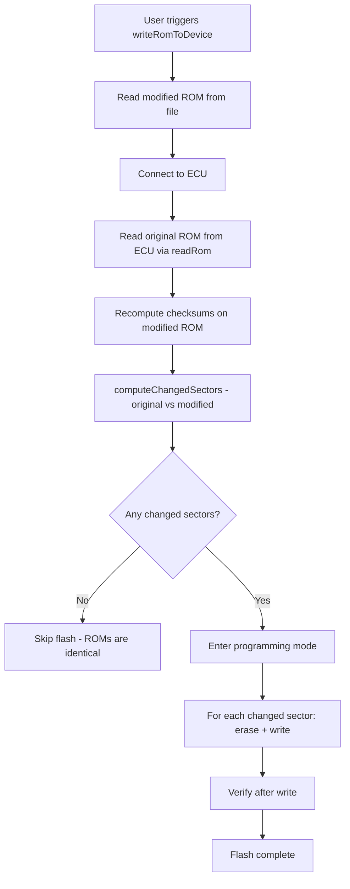

# ROM Write Diff Before Flashing

## Overview

Before initiating a flash write session, compare the modified ROM image (to be written) against the original ROM image (read from the ECU) to identify which flash sectors actually contain changed bytes. Only sectors containing differences are erased and rewritten; unchanged sectors are skipped entirely.

This feature mirrors the behaviour of EcuFlash's sector-level diff, which is the industry-standard approach for ECU calibration flashing.

### User Value Proposition

- Dramatically faster flash times — a typical calibration tune changes only 1–3 of 16 sectors
- Reduced flash wear — ECU flash has a finite erase cycle lifetime (~10,000 cycles per sector)
- Lower brick risk — fewer erase windows means fewer opportunities for power-loss corruption
- Code region protection — firmware/code sectors are never accidentally erased

### Acceptance Criteria

- [x] `WriteOptions` accepts an optional `originalRom` field
- [x] `computeChangedSectors()` correctly identifies sectors with at least one differing byte
- [x] `computeChangedSectors()` returns an empty array when both images are identical
- [x] `computeChangedSectors()` returns all sectors when `originalRom` is not provided
- [x] Mitsubishi bootloader `writeRom()` skips erase+write for unchanged sectors when `originalRom` is provided
- [x] Subaru KWP2000 `writeRom()` skips erase+write for unchanged sectors when `originalRom` is provided
- [x] UDS `writeRom()` skips erase+write for unchanged sectors when `originalRom` is provided
- [x] `writeRomToDevice` command reads the current ROM from the ECU before writing and passes it as `options.originalRom`
- [x] Progress reporting shows "Reading current ROM from ECU" phase before the write phase
- [x] `dryRun` mode still works correctly when `originalRom` is provided
- [x] Checksums are recomputed on the full modified ROM before diffing

---

## Motivation

### Speed (Primary)

Flash erase is the slowest operation in the write sequence. On a 1 MB SH7058 ROM with 16 sectors of 64 KB each, a typical calibration tune modifies only 1–3 sectors (fuel maps, ignition maps, boost tables). Skipping the 13–15 unchanged sectors reduces total flash time by approximately 70–90%.

### Flash Wear Reduction

ECU flash memory has a finite erase cycle lifetime, typically ~10,000 cycles per sector. Each unnecessary erase of a code sector consumes one of those cycles permanently. Diffing ensures that code sectors — which almost never change between tunes — are never erased.

### Reduced Brick Risk

Power loss during a flash erase or write is the most dangerous moment for an ECU. If power is lost mid-erase, the sector is left in an indeterminate state and the ECU will not boot. Fewer sectors erased means fewer vulnerable windows during which a power interruption would brick the ECU.

### Code Region Protection

ROM images contain both calibration data (fuel maps, ignition tables, boost limits) and firmware/code (the ECU's operating software). Calibration data changes with every tune; firmware almost never changes. Diffing ensures that code sectors are never touched unless the firmware itself has been updated.

---

## Technical Design

### Sector Granularity

Flash memory can only be erased in whole sectors (erase blocks). Byte-level diffing is not meaningful for erase decisions — if even one byte in a sector differs, the entire sector must be erased and rewritten. The diff therefore operates at **sector granularity**.

The sector size is protocol- and ECU-specific:

| ECU / Protocol | ROM Size | Typical Sector Size | Sector Count |
|---|---|---|---|
| Mitsubishi SH7058 (bootloader) | 1 MB | 64 KB | 16 |
| Subaru/Denso SH7058 (KWP2000) | 1 MB | 64 KB | 16 |
| Generic UDS | configurable | configurable | configurable |

### Diff Algorithm

The algorithm is O(n) per sector with early exit on first difference:

```
function computeChangedSectors(original, modified, sectorSize):
    assert original.length == modified.length
    assert modified.length % sectorSize == 0

    changedSectors = []
    numSectors = modified.length / sectorSize

    for i in 0..numSectors:
        start = i * sectorSize
        end   = start + sectorSize
        for j in start..end:
            if original[j] != modified[j]:
                changedSectors.append(i)
                break   // early exit — no need to scan rest of sector

    return changedSectors
```

When `originalRom` is not provided, all sectors are treated as changed (full erase+write, current behaviour).

### Data Flow



### Checksum Ordering

Checksums **must** be recomputed on the full modified ROM **before** the diff is computed. This ensures that:

1. The checksum region itself is included in the diff (if checksums changed, the checksum sector will be marked as changed).
2. The ROM written to the ECU has valid checksums.

If checksums are recomputed after the diff, the checksum sector may be skipped even though its bytes have changed, resulting in an ECU with an invalid checksum.

---

## API Changes

### `WriteOptions` — `packages/device/src/types.ts`

Add an optional `originalRom` field:

```typescript
export interface WriteOptions {
    /** If true, skip the actual flash erase/write but perform all other steps */
    dryRun?: boolean;
    /** Verify checksums in the ROM before writing */
    verifyChecksums?: boolean;
    /**
     * The original ROM image read from the ECU before modification.
     * When provided, only sectors that differ between originalRom and the
     * ROM being written will be erased and rewritten. Unchanged sectors
     * are skipped entirely.
     *
     * Must be the same length as the ROM being written.
     * If not provided, all sectors are erased and rewritten (full flash).
     */
    originalRom?: Uint8Array;
}
```

### New Utility — `packages/device/src/diff.ts`

```typescript
/**
 * Identifies which flash sectors differ between two ROM images.
 *
 * Operates at sector (erase block) granularity because flash can only be
 * erased in whole sectors. Uses O(n) byte comparison per sector with early
 * exit on first difference.
 *
 * @param original   - ROM image read from the ECU (before modification)
 * @param modified   - ROM image to be written (after modification)
 * @param sectorSize - Size of one flash erase block in bytes (e.g. 0x10000 for 64 KB)
 * @returns          - Array of zero-based sector indices that contain at least one changed byte
 * @throws           - If original and modified have different lengths
 * @throws           - If modified.length is not a multiple of sectorSize
 *
 * @example
 * // 1 MB ROM, 64 KB sectors → 16 sectors
 * const changed = computeChangedSectors(originalRom, modifiedRom, 0x10000);
 * // changed might be [2, 7] — only sectors 2 and 7 differ
 */
export function computeChangedSectors(
    original: Uint8Array,
    modified: Uint8Array,
    sectorSize: number,
): number[]
```

The function must be exported from `packages/device/src/index.ts` as part of the public API.

### `EcuProtocol.writeRom()` — all three implementations

No change to the method signature. The `options` parameter already accepts `WriteOptions`. Each implementation reads `options?.originalRom` and calls `computeChangedSectors()` internally.

---

## Implementation Steps

1. **Add `originalRom` to `WriteOptions`**
   - File: [`packages/device/src/types.ts`](../packages/device/src/types.ts)
   - Add `originalRom?: Uint8Array` with JSDoc comment as shown above

2. **Create `computeChangedSectors()` utility**
   - File: [`packages/device/src/diff.ts`](../packages/device/src/diff.ts) (new file)
   - Implement the O(n) sector diff algorithm with early exit
   - Validate that `original.length === modified.length`
   - Validate that `modified.length % sectorSize === 0`
   - Export from [`packages/device/src/index.ts`](../packages/device/src/index.ts)

3. **Update Mitsubishi bootloader `writeRom()`**
   - File: [`packages/device/protocols/mitsubishi-bootloader/src/index.ts`](../packages/device/protocols/mitsubishi-bootloader/src/index.ts)
   - When `options?.originalRom` is provided, call `computeChangedSectors(options.originalRom, rom, SECTOR_SIZE)`
   - Define `SECTOR_SIZE = 0x10000` (64 KB) for SH7058
   - Loop over changed sectors only: send `CMD_ERASE` per sector, then write blocks within that sector
   - When `options?.originalRom` is not provided, fall back to current full-erase behaviour

4. **Update Subaru KWP2000 `writeRom()`**
   - File: [`packages/device/protocols/subaru/src/index.ts`](../packages/device/protocols/subaru/src/index.ts)
   - When `options?.originalRom` is provided, call `computeChangedSectors(options.originalRom, rom, SECTOR_SIZE)`
   - Define `SECTOR_SIZE = 0x10000` (64 KB) for SH7058
   - Loop over changed sectors only: send `SID_ERASE_MEMORY` per sector with sector address, then transfer data for that sector
   - When `options?.originalRom` is not provided, fall back to current full-erase behaviour

5. **Update UDS `writeRom()`**
   - File: [`packages/device/protocols/uds/src/index.ts`](../packages/device/protocols/uds/src/index.ts)
   - Add a `protected readonly SECTOR_SIZE: number = 0x10000` field (overridable by subclasses)
   - When `options?.originalRom` is provided, call `computeChangedSectors(options.originalRom, rom, this.SECTOR_SIZE)`
   - Loop over changed sectors only: send `RequestDownload` per sector, transfer data for that sector, send `RequestTransferExit`
   - When `options?.originalRom` is not provided, fall back to current full-ROM `RequestDownload` behaviour

6. **Update `writeRomToDevice` command**
   - File: [`apps/vscode/src/extension.ts`](../apps/vscode/src/extension.ts)
   - After connecting to the ECU and before the confirmation dialog, call `matchedProtocol.readRom(connection, ...)` to read the current ROM
   - Pass the result as `options.originalRom` to `writeRom()`
   - Update the progress notification to indicate the read-back phase
   - Handle the case where `readRom` is not supported by the protocol (fall back to full flash)

---

## Testing Requirements

### Unit Tests — `packages/device/src/diff.ts`

File: `packages/device/test/diff.test.ts` (new file)

| Test | Description |
|---|---|
| Identical ROMs | Returns empty array when original === modified |
| Single byte diff in sector 0 | Returns `[0]` |
| Single byte diff in last sector | Returns `[numSectors - 1]` |
| Diff in multiple non-adjacent sectors | Returns correct sector indices in order |
| All sectors changed | Returns all sector indices |
| Early exit | Verifies that comparison stops at first differing byte per sector |
| Length mismatch | Throws when `original.length !== modified.length` |
| Non-multiple sector size | Throws when `modified.length % sectorSize !== 0` |
| Zero-length ROM | Throws or returns empty array (define expected behaviour) |
| Sector size = 1 | Degenerates to byte-level diff |

Coverage target: 100% lines, 100% branches.

### Unit Tests — Protocol `writeRom()` with diff

Each protocol test file should add tests for the diff path:

| Test | File | Description |
|---|---|---|
| Skips unchanged sectors | `mitsubishi-bootloader/test/index.test.ts` | Only changed sectors are erased+written |
| Full flash when no originalRom | `mitsubishi-bootloader/test/index.test.ts` | Existing full-flash tests still pass |
| Skips unchanged sectors | `subaru/test/index.test.ts` | Only changed sectors are erased+written |
| Full flash when no originalRom | `subaru/test/index.test.ts` | Existing full-flash tests still pass |
| Skips unchanged sectors | `uds/test/index.test.ts` | Only changed sectors are erased+written |
| Full flash when no originalRom | `uds/test/index.test.ts` | Existing full-flash tests still pass |
| dryRun still works with originalRom | all three | dryRun short-circuits before diff |

### Integration Tests — `writeRomToDevice` command

File: `apps/vscode/test/rom-flow.test.ts` (extend existing)

| Test | Description |
|---|---|
| Reads ROM before writing | `readRom` is called before `writeRom` |
| Passes originalRom to writeRom | `writeRom` receives `options.originalRom` |
| Falls back to full flash if readRom unsupported | Protocol without `readRom` still flashes |
| Progress includes read-back phase | Progress notification shows read phase |

---

## Safety Considerations

### Checksum Must Be Recomputed Before Diffing

The checksum recomputation step (already performed by the save flow) must complete before `computeChangedSectors()` is called. If the checksum bytes change, the sector containing the checksum region will be correctly identified as changed and will be included in the write.

**Ordering**:
1. Apply user edits to ROM buffer
2. Recompute checksums (updates checksum bytes in ROM buffer)
3. Call `computeChangedSectors(originalRom, modifiedRom, sectorSize)`
4. Erase and write only the changed sectors

### Never Interrupt a Sector Erase or Write

The `cancellable: false` flag on the VSCode progress notification must remain in place. Cancellation mid-sector is more dangerous than completing the current sector. If cancellation support is added in the future, it must only cancel between sectors, never within a sector erase or write.

### Verify After Write

The existing verify step (CMD_VERIFY for Mitsubishi, implicit in KWP2000 transfer exit, or a separate readback) must still be performed after all changed sectors have been written. The verify should cover the full ROM, not just the changed sectors, to catch any corruption in sectors that were not written.

### Size Mismatch Guard

`computeChangedSectors()` must throw if `original.length !== modified.length`. A size mismatch indicates that the wrong ROM image was loaded (e.g., a different ECU variant), and proceeding with a partial diff would be dangerous.

### Fallback to Full Flash

If `options.originalRom` is not provided (e.g., `readRom` failed or the protocol does not support it), the implementation must fall back to the current full-erase behaviour. This ensures backward compatibility and a safe default.

---

## Implementation Status

**Status**: ✅ Fully implemented — all acceptance criteria met

**Spec written**: 2026-02-21

**Fully completed**: 2026-02-21

### Completed

- `originalRom?: Uint8Array` added to `WriteOptions` in [`packages/device/src/types.ts`](../packages/device/src/types.ts)
- `computeChangedSectors()` created in [`packages/device/src/diff.ts`](../packages/device/src/diff.ts) and exported from [`packages/device/src/index.ts`](../packages/device/src/index.ts)
- Mitsubishi bootloader `writeRom()` updated — [`packages/device/protocols/mitsubishi-bootloader/src/index.ts`](../packages/device/protocols/mitsubishi-bootloader/src/index.ts)
- Subaru KWP2000 `writeRom()` updated — [`packages/device/protocols/subaru/src/index.ts`](../packages/device/protocols/subaru/src/index.ts)
- UDS `writeRom()` updated — [`packages/device/protocols/uds/src/index.ts`](../packages/device/protocols/uds/src/index.ts)
- `ecuExplorer.writeRomToDevice` command updated in [`apps/vscode/src/extension.ts`](../apps/vscode/src/extension.ts) — reads current ROM from ECU before writing, passes as `options.originalRom`; progress reporting shows "Reading current ROM from ECU" phase
- 1160 tests passing (24 new unit tests in [`packages/device/test/diff.test.ts`](../packages/device/test/diff.test.ts); protocol tests updated)

**Related items**:
- [`DEVELOPMENT.md`](../DEVELOPMENT.md) — v1 feature: "ROM write diffs before flashing"
- [`packages/device/src/types.ts`](../packages/device/src/types.ts) — `WriteOptions` interface
- [`packages/device/protocols/mitsubishi-bootloader/src/index.ts`](../packages/device/protocols/mitsubishi-bootloader/src/index.ts) — Mitsubishi `writeRom()`
- [`packages/device/protocols/subaru/src/index.ts`](../packages/device/protocols/subaru/src/index.ts) — Subaru `writeRom()`
- [`packages/device/protocols/uds/src/index.ts`](../packages/device/protocols/uds/src/index.ts) — UDS `writeRom()`
- [`apps/vscode/src/extension.ts`](../apps/vscode/src/extension.ts) — `ecuExplorer.writeRomToDevice` command
