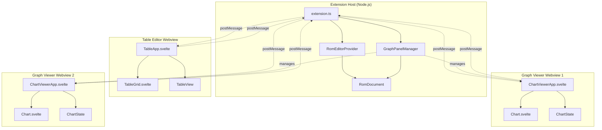
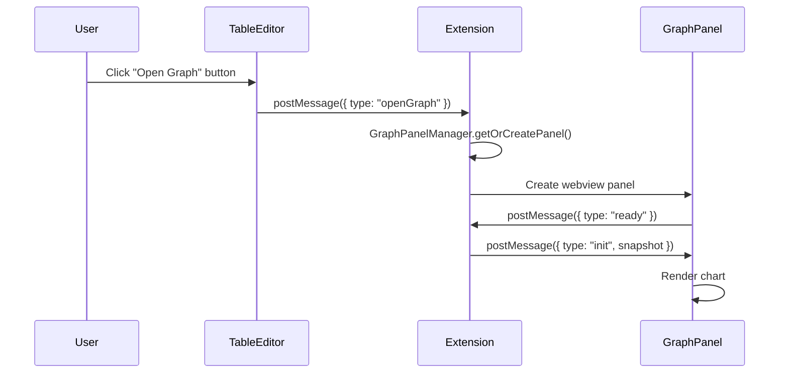
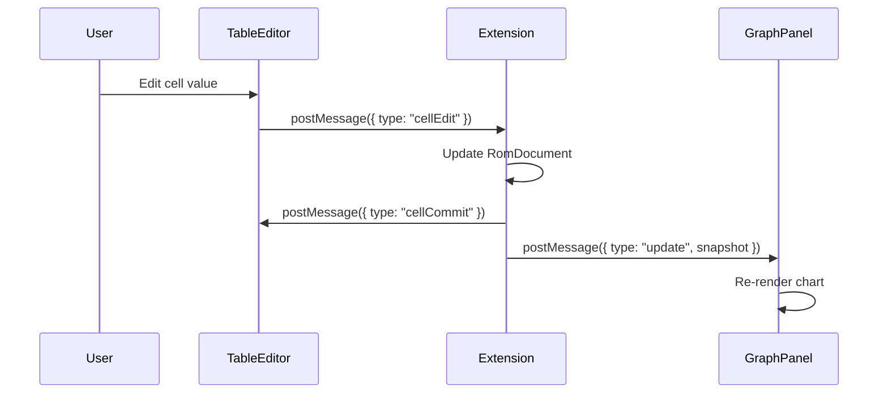
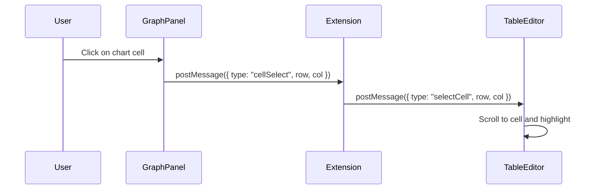
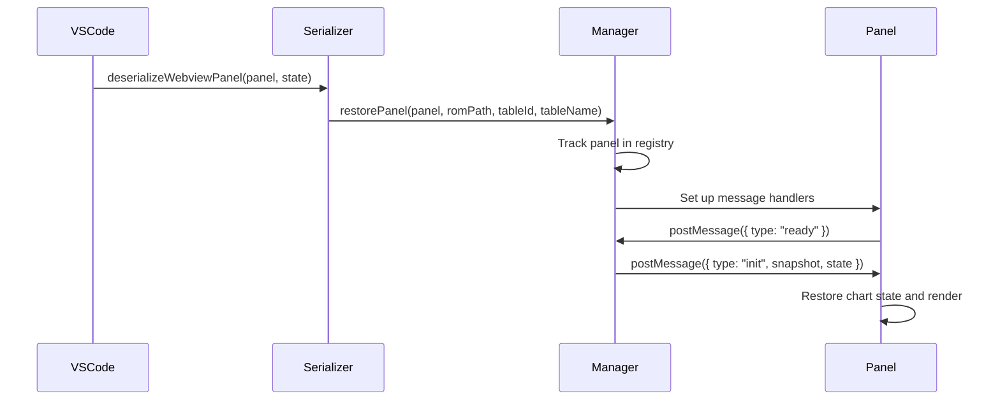
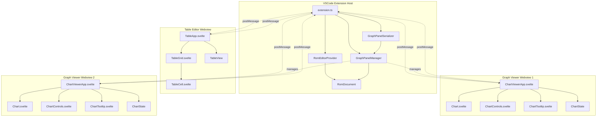
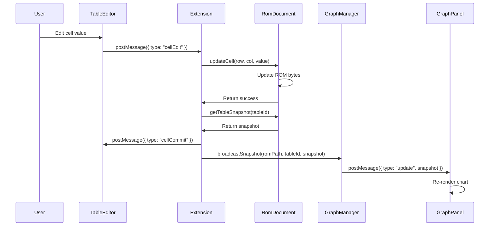
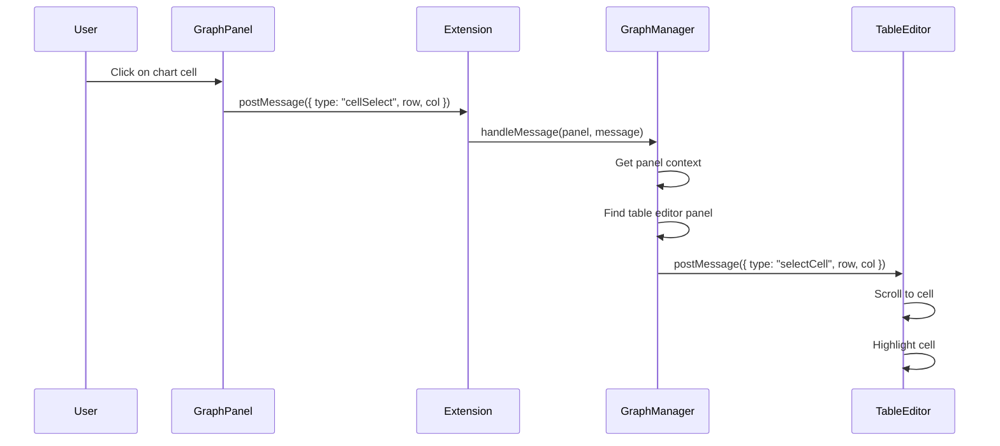

# Separate Graph Windows Specification

**Status**: Design Phase  
**Created**: 2026-02-14  
**Related Specs**: [`graph-visualization.md`](graph-visualization.md), [`WEBVIEW_PROTOCOL.md`](WEBVIEW_PROTOCOL.md)

---

## Table of Contents

1. [Overview](#overview)
2. [Architecture](#architecture)
3. [Technical Design](#technical-design)
4. [Commands and User Interface](#commands-and-user-interface)
5. [State Management](#state-management)
6. [Persistence](#persistence)
7. [Message Protocol Extensions](#message-protocol-extensions)
8. [Implementation Plan](#implementation-plan)
9. [Testing Strategy](#testing-strategy)
10. [Migration Strategy](#migration-strategy)
11. [Acceptance Criteria](#acceptance-criteria)
12. [Known Limitations and Future Work](#known-limitations-and-future-work)

---

## Overview

### Current State

The graph visualization feature currently uses a split view within a single webview panel:

- **Single Webview**: [`TableApp.svelte`](../apps/vscode/src/webview/TableApp.svelte) contains both table grid and chart
- **Split Layout**: [`SplitView.svelte`](../packages/ui/src/lib/views/SplitView.svelte) provides horizontal split with resizable divider
- **Shared State**: Chart and grid share the same webview instance and state
- **Toggle Visibility**: Chart can be shown/hidden with keyboard shortcut (Ctrl+Shift+C)

**Limitations**:
- Cannot view multiple graphs simultaneously
- Cannot arrange graphs independently (e.g., side-by-side, multi-monitor)
- Chart takes up valuable table editing space
- Cannot compare graphs from different tables
- Limited screen real estate for complex workflows

### Proposed State

Refactor to use separate VSCode webview panels for graphs:

- **Separate Windows**: Each graph opens in its own VSCode webview panel
- **Independent Positioning**: Users can arrange graph windows freely (tabs, splits, multi-monitor)
- **Multi-Graph Support**: View graphs from multiple tables simultaneously
- **Persistent State**: Graph windows survive VSCode reload
- **Bidirectional Sync**: Changes in table editor update graph windows; clicks in graph select cells in table

**Benefits**:
1. **Better Screen Utilization**: Full table editor space + separate graph windows
2. **Multi-Monitor Support**: Place graphs on secondary monitors
3. **Comparison Workflows**: View multiple graphs side-by-side
4. **Flexible Layouts**: Users control window arrangement
5. **Professional UX**: Matches VSCode's multi-panel paradigm

### Rationale

**Why Separate Windows?**

1. **User Feedback**: Users want to view graphs while editing tables without losing screen space
2. **VSCode Paradigm**: Separate panels are standard in VSCode (e.g., terminal, output, debug console)
3. **Flexibility**: Users can arrange windows to match their workflow
4. **Scalability**: Supports advanced workflows (comparing multiple tables, multi-monitor setups)

**Why Not Keep Split View?**

- Split view is limiting for complex workflows
- Cannot view multiple graphs simultaneously
- Wastes table editing space when graph is visible
- Doesn't leverage VSCode's multi-panel capabilities

**Design Philosophy**:
- **User Control**: Let users decide window arrangement
- **Non-Intrusive**: Opening a graph doesn't disrupt table editing
- **Persistent**: Graph windows survive VSCode reload
- **Synchronized**: Graph and table stay in sync automatically

---

## Architecture

### Component Diagram



### Panel Management Strategy

**GraphPanelManager** is responsible for:

1. **Panel Lifecycle**: Create, track, and dispose graph panels
2. **Panel Registry**: Map ROM + table → graph panel
3. **Snapshot Sync**: Broadcast table updates to relevant graph panels
4. **Cell Selection Sync**: Forward cell selection from graph to table editor
5. **Serialization**: Persist panel state for VSCode reload

**Panel Tracking Structure**:

```typescript
// Map: ROM path → table ID → graph panel
Map<string, Map<string, vscode.WebviewPanel>>

// Example:
{
  "/path/to/rom.bin": {
    "Boost_Target_1A": WebviewPanel,
    "Fuel_Injection_Timing": WebviewPanel
  },
  "/path/to/another.bin": {
    "Ignition_Timing": WebviewPanel
  }
}
```

### State Synchronization Approach

**Unidirectional Data Flow**:

```
Table Edit
    ↓
Extension Host (RomDocument)
    ↓
GraphPanelManager.broadcastSnapshot()
    ↓
All Graph Panels for that ROM + Table
    ↓
Chart Re-renders
```

**Bidirectional Cell Selection**:

```
Graph Click
    ↓
Graph Panel sends "cellSelect" message
    ↓
Extension Host
    ↓
Table Editor receives "selectCell" message
    ↓
Grid scrolls to cell and highlights
```

### Message Flow Diagrams

#### Opening a Graph Window



#### Synchronizing Table Edits to Graph



#### Synchronizing Graph Clicks to Table



---

## Technical Design

### New Components to Create

#### 1. `ChartViewerApp.svelte`

**Location**: `apps/vscode/src/webview/ChartViewerApp.svelte`

**Purpose**: Standalone chart viewer webview application

**Responsibilities**:
- Render chart using existing [`Chart.svelte`](../packages/ui/src/lib/views/Chart.svelte) component
- Handle webview messaging (init, update, cellSelect)
- Manage chart state using [`ChartState`](../packages/ui/src/lib/views/chart.svelte.ts)
- Provide chart controls (zoom, pan, layer selection)
- Display table metadata (name, dimensions, unit)

**Props/State**:
```typescript
interface ChartViewerState {
  snapshot: TableSnapshot | null;
  tableName: string;
  romPath: string;
  chartState: ChartState;
  isReady: boolean;
}
```

**Message Handlers**:
- `init`: Receive initial table snapshot
- `update`: Receive updated snapshot after table edits
- `selectCell`: Highlight cell in chart (from table editor)

**Message Senders**:
- `ready`: Signal webview is ready
- `cellSelect`: User clicked on chart cell

**Example Structure**:
```svelte
<script lang="ts">
  import { Chart, ChartControls, ChartState } from "@repo/ui";
  import { onMount } from "svelte";
  
  let vscode = acquireVsCodeApi();
  let chartState = new ChartState();
  let snapshot = $state<TableSnapshot | null>(null);
  let tableName = $state("");
  let romPath = $state("");
  
  onMount(() => {
    window.addEventListener("message", handleMessage);
    vscode.postMessage({ type: "ready" });
  });
  
  function handleMessage(event: MessageEvent) {
    const message = event.data;
    switch (message.type) {
      case "init":
        snapshot = message.snapshot;
        tableName = message.tableName;
        romPath = message.romPath;
        chartState.setSnapshot(snapshot);
        break;
      case "update":
        snapshot = message.snapshot;
        chartState.setSnapshot(snapshot);
        break;
      case "selectCell":
        chartState.selectCell(message.row, message.col);
        break;
    }
  }
  
  function handleCellSelect(row: number, col: number) {
    vscode.postMessage({ type: "cellSelect", row, col });
  }
</script>

<div class="chart-viewer">
  <header>
    <h1>{tableName}</h1>
    <span class="rom-path">{romPath}</span>
  </header>
  
  <ChartControls {chartState} />
  
  {#if snapshot}
    <Chart {chartState} onCellSelect={handleCellSelect} />
  {:else}
    <div class="loading">Loading chart...</div>
  {/if}
</div>
```

#### 2. `GraphPanelManager`

**Location**: `apps/vscode/src/graph-panel-manager.ts`

**Purpose**: Manage lifecycle and state of graph webview panels

**Responsibilities**:
- Create and track graph panels
- Broadcast snapshot updates to relevant panels
- Handle cell selection synchronization
- Implement WebviewPanelSerializer for persistence
- Clean up disposed panels

**Class Structure**:
```typescript
/**
 * Manages graph webview panels for ROM tables
 * 
 * Responsibilities:
 * - Create and track graph panels per ROM + table
 * - Broadcast snapshot updates to relevant panels
 * - Synchronize cell selection between graph and table
 * - Persist panel state across VSCode reload
 */
export class GraphPanelManager {
  // Panel registry: ROM path → table ID → panel
  private panels = new Map<string, Map<string, vscode.WebviewPanel>>();
  
  // Reverse lookup: panel → context
  private panelContext = new Map<vscode.WebviewPanel, {
    romPath: string;
    tableId: string;
    tableName: string;
  }>();
  
  constructor(
    private context: vscode.ExtensionContext,
    private getDocument: (romPath: string) => RomDocument | undefined
  ) {}
  
  /**
   * Get or create a graph panel for a ROM table
   * 
   * If a panel already exists for this ROM + table, reveal it.
   * Otherwise, create a new panel.
   * 
   * @param romPath - Path to ROM file
   * @param tableId - Table identifier
   * @param tableName - Human-readable table name
   * @param snapshot - Initial table snapshot
   * @returns Webview panel
   */
  getOrCreatePanel(
    romPath: string,
    tableId: string,
    tableName: string,
    snapshot: TableSnapshot
  ): vscode.WebviewPanel {
    // Check if panel already exists
    const existing = this.panels.get(romPath)?.get(tableId);
    if (existing) {
      existing.reveal();
      return existing;
    }
    
    // Create new panel
    const panel = vscode.window.createWebviewPanel(
      'ecuExplorerGraph',
      `Graph: ${tableName}`,
      vscode.ViewColumn.Beside,
      {
        enableScripts: true,
        retainContextWhenHidden: true,
        localResourceRoots: [
          vscode.Uri.joinPath(this.context.extensionUri, 'dist')
        ]
      }
    );
    
    // Set HTML content
    panel.webview.html = this.getWebviewContent(panel.webview);
    
    // Track panel
    this.trackPanel(panel, romPath, tableId, tableName);
    
    // Set up message handler
    panel.webview.onDidReceiveMessage(
      message => this.handleMessage(panel, message),
      undefined,
      this.context.subscriptions
    );
    
    // Clean up on dispose
    panel.onDidDispose(
      () => this.disposePanel(panel),
      undefined,
      this.context.subscriptions
    );
    
    return panel;
  }
  
  /**
   * Broadcast snapshot update to all panels for a ROM + table
   * 
   * Called when table data changes (cell edit, undo, redo, etc.)
   * 
   * @param romPath - Path to ROM file
   * @param tableId - Table identifier
   * @param snapshot - Updated table snapshot
   */
  broadcastSnapshot(
    romPath: string,
    tableId: string,
    snapshot: TableSnapshot
  ): void {
    const panel = this.panels.get(romPath)?.get(tableId);
    if (panel) {
      panel.webview.postMessage({
        type: 'update',
        snapshot
      });
    }
  }
  
  /**
   * Send cell selection to graph panel
   * 
   * Called when user selects a cell in table editor
   * 
   * @param romPath - Path to ROM file
   * @param tableId - Table identifier
   * @param row - Row index
   * @param col - Column index
   */
  selectCell(
    romPath: string,
    tableId: string,
    row: number,
    col: number
  ): void {
    const panel = this.panels.get(romPath)?.get(tableId);
    if (panel) {
      panel.webview.postMessage({
        type: 'selectCell',
        row,
        col
      });
    }
  }
  
  /**
   * Handle message from graph panel
   */
  private handleMessage(
    panel: vscode.WebviewPanel,
    message: any
  ): void {
    const context = this.panelContext.get(panel);
    if (!context) return;
    
    switch (message.type) {
      case 'ready':
        // Send initial snapshot
        const doc = this.getDocument(context.romPath);
        if (doc) {
          const snapshot = doc.getTableSnapshot(context.tableId);
          panel.webview.postMessage({
            type: 'init',
            snapshot,
            tableName: context.tableName,
            romPath: context.romPath
          });
        }
        break;
        
      case 'cellSelect':
        // Forward to table editor
        this.forwardCellSelection(
          context.romPath,
          context.tableId,
          message.row,
          message.col
        );
        break;
    }
  }
  
  /**
   * Forward cell selection from graph to table editor
   */
  private forwardCellSelection(
    romPath: string,
    tableId: string,
    row: number,
    col: number
  ): void {
    // Find table editor panel for this ROM
    const doc = this.getDocument(romPath);
    if (doc) {
      const tablePanel = doc.getWebviewPanel();
      if (tablePanel) {
        tablePanel.webview.postMessage({
          type: 'selectCell',
          tableId,
          row,
          col
        });
      }
    }
  }
  
  /**
   * Track a panel in the registry
   */
  private trackPanel(
    panel: vscode.WebviewPanel,
    romPath: string,
    tableId: string,
    tableName: string
  ): void {
    if (!this.panels.has(romPath)) {
      this.panels.set(romPath, new Map());
    }
    this.panels.get(romPath)!.set(tableId, panel);
    
    this.panelContext.set(panel, { romPath, tableId, tableName });
  }
  
  /**
   * Clean up disposed panel
   */
  private disposePanel(panel: vscode.WebviewPanel): void {
    const context = this.panelContext.get(panel);
    if (context) {
      this.panels.get(context.romPath)?.delete(context.tableId);
      this.panelContext.delete(panel);
    }
  }
  
  /**
   * Get webview HTML content
   */
  private getWebviewContent(webview: vscode.Webview): string {
    const scriptUri = webview.asWebviewUri(
      vscode.Uri.joinPath(this.context.extensionUri, 'dist', 'chart-viewer.js')
    );
    const styleUri = webview.asWebviewUri(
      vscode.Uri.joinPath(this.context.extensionUri, 'dist', 'chart-viewer.css')
    );
    
    return `<!DOCTYPE html>
    <html lang="en">
    <head>
      <meta charset="UTF-8">
      <meta name="viewport" content="width=device-width, initial-scale=1.0">
      <link href="${styleUri}" rel="stylesheet">
      <title>Graph Viewer</title>
    </head>
    <body>
      <div id="app"></div>
      <script type="module" src="${scriptUri}"></script>
    </body>
    </html>`;
  }
}
```

#### 3. `GraphPanelSerializer`

**Location**: `apps/vscode/src/graph-panel-serializer.ts`

**Purpose**: Persist graph panel state across VSCode reload

**Implementation**:
```typescript
/**
 * Serializer for graph webview panels
 * 
 * Persists panel state across VSCode reload
 */
export class GraphPanelSerializer implements vscode.WebviewPanelSerializer {
  constructor(
    private graphPanelManager: GraphPanelManager
  ) {}
  
  /**
   * Deserialize a webview panel
   * 
   * Called when VSCode restores a panel after reload
   */
  async deserializeWebviewPanel(
    webviewPanel: vscode.WebviewPanel,
    state: any
  ): Promise<void> {
    // Restore panel state
    const { romPath, tableId, tableName } = state;
    
    // Re-register panel with manager
    // Manager will set up message handlers and restore snapshot
    await this.graphPanelManager.restorePanel(
      webviewPanel,
      romPath,
      tableId,
      tableName
    );
  }
}
```

### Components to Refactor

#### 1. `TableApp.svelte`

**Changes**:
- Remove split view toggle logic
- Remove embedded chart rendering
- Add "Open Graph" button in toolbar
- Send `openGraph` message to extension host
- Handle `selectCell` message from extension (forwarded from graph)

**Before**:
```svelte
<script>
  let showChart = $state(false);
  
  function toggleChart() {
    showChart = !showChart;
  }
</script>

{#if showChart}
  <SplitView>
    {#snippet leftContent()}
      <TableGrid ... />
    {/snippet}
    {#snippet rightContent()}
      <Chart ... />
    {/snippet}
  </SplitView>
{:else}
  <TableGrid ... />
{/if}
```

**After**:
```svelte
<script>
  function openGraph() {
    vscode.postMessage({ type: "openGraph" });
  }
  
  function handleMessage(event: MessageEvent) {
    const message = event.data;
    switch (message.type) {
      case "selectCell":
        // Scroll to and highlight cell
        tableView.selectCell(message.row, message.col);
        break;
      // ... other cases
    }
  }
</script>

<div class="table-editor">
  <header>
    <button onclick={openGraph}>Open Graph</button>
    <!-- other toolbar buttons -->
  </header>
  
  <TableGrid ... />
</div>
```

#### 2. `extension.ts`

**Changes**:
- Instantiate `GraphPanelManager`
- Register `GraphPanelSerializer`
- Add command handlers for opening graphs
- Forward snapshot updates to `GraphPanelManager`
- Handle cell selection messages from graph panels

**New Code**:
```typescript
// Initialize GraphPanelManager
const graphPanelManager = new GraphPanelManager(
  context,
  (romPath: string) => romEditorProvider.getDocument(vscode.Uri.file(romPath))
);

// Register serializer
context.subscriptions.push(
  vscode.window.registerWebviewPanelSerializer(
    'ecuExplorerGraph',
    new GraphPanelSerializer(graphPanelManager)
  )
);

// Register commands
context.subscriptions.push(
  vscode.commands.registerCommand(
    'ecuExplorer.openGraphForActiveTable',
    async () => {
      // Get active table editor
      const activePanel = getActiveTableEditorPanel();
      if (!activePanel) {
        vscode.window.showErrorMessage('No active table editor');
        return;
      }
      
      // Get ROM document and table info
      const doc = getRomDocumentForPanel(activePanel);
      if (!doc) return;
      
      const tableId = doc.activeTableId;
      const tableName = doc.activeTableName;
      const snapshot = doc.getTableSnapshot(tableId);
      
      // Open graph panel
      graphPanelManager.getOrCreatePanel(
        doc.uri.fsPath,
        tableId,
        tableName,
        snapshot
      );
    }
  )
);

// Handle webview messages
function handleWebviewMessage(panel: vscode.WebviewPanel, message: any) {
  switch (message.type) {
    case 'openGraph':
      // Open graph for current table
      const doc = getRomDocumentForPanel(panel);
      if (doc) {
        const snapshot = doc.getTableSnapshot(doc.activeTableId);
        graphPanelManager.getOrCreatePanel(
          doc.uri.fsPath,
          doc.activeTableId,
          doc.activeTableName,
          snapshot
        );
      }
      break;
      
    case 'cellEdit':
      // Handle cell edit, then broadcast to graph panels
      const result = await handleCellEdit(panel, message);
      if (result.success) {
        graphPanelManager.broadcastSnapshot(
          result.romPath,
          result.tableId,
          result.snapshot
        );
      }
      break;
  }
}
```

### Components to Reuse As-Is

The following components require **no changes**:

1. **[`Chart.svelte`](../packages/ui/src/lib/views/Chart.svelte)** - Chart rendering component
2. **[`ChartState`](../packages/ui/src/lib/views/chart.svelte.ts)** - Chart state management
3. **[`ChartControls.svelte`](../packages/ui/src/lib/views/ChartControls.svelte)** - Chart control panel
4. **[`ChartTooltip.svelte`](../packages/ui/src/lib/views/ChartTooltip.svelte)** - Hover tooltip
5. **[`chartUtils.ts`](../packages/ui/src/lib/views/chartUtils.ts)** - Chart utilities
6. **[`colorMap.ts`](../packages/ui/src/lib/views/colorMap.ts)** - Heatmap color computation
7. **[`TableGrid.svelte`](../packages/ui/src/lib/views/TableGrid.svelte)** - Table grid component
8. **[`TableCell.svelte`](../packages/ui/src/lib/views/TableCell.svelte)** - Table cell component
9. **[`table.svelte.ts`](../packages/ui/src/lib/views/table.svelte.ts)** - Table state management

These components are already designed to be reusable and work independently.

---

## Commands and User Interface

### Commands

#### 1. `ecuExplorer.openGraphForActiveTable`

**Purpose**: Open graph window for the currently active table

**Trigger**:
- Command palette: "ECU Explorer: Open Graph for Active Table"
- Keyboard shortcut: `Ctrl+Shift+G` (Windows/Linux), `Cmd+Shift+G` (Mac)
- Toolbar button in table editor

**Behavior**:
1. Check if a table editor is active
2. Get ROM document and table information
3. Create or reveal graph panel for that table
4. Send initial snapshot to graph panel

**Error Handling**:
- No active table editor → Show error message
- ROM not loaded → Show error message
- Table not found → Show error message

**Implementation**:
```typescript
vscode.commands.registerCommand(
  'ecuExplorer.openGraphForActiveTable',
  async () => {
    const activePanel = getActiveTableEditorPanel();
    if (!activePanel) {
      vscode.window.showErrorMessage('No active table editor');
      return;
    }
    
    const doc = getRomDocumentForPanel(activePanel);
    if (!doc) {
      vscode.window.showErrorMessage('ROM not loaded');
      return;
    }
    
    const tableId = doc.activeTableId;
    const tableName = doc.activeTableName;
    const snapshot = doc.getTableSnapshot(tableId);
    
    if (!snapshot) {
      vscode.window.showErrorMessage('Table not found');
      return;
    }
    
    graphPanelManager.getOrCreatePanel(
      doc.uri.fsPath,
      tableId,
      tableName,
      snapshot
    );
  }
);
```

#### 2. `ecuExplorer.openGraph`

**Purpose**: Open graph window with specific context (used by tree view)

**Trigger**:
- Context menu in ECU Explorer tree view: "Open Graph"
- Programmatic calls from other commands

**Parameters**:
```typescript
interface OpenGraphArgs {
  romPath: string;
  tableId: string;
  tableName: string;
}
```

**Behavior**:
1. Load ROM document if not already loaded
2. Get table snapshot
3. Create or reveal graph panel
4. Send initial snapshot

**Implementation**:
```typescript
vscode.commands.registerCommand(
  'ecuExplorer.openGraph',
  async (args: OpenGraphArgs) => {
    const { romPath, tableId, tableName } = args;
    
    // Get or load ROM document
    const doc = await getOrLoadRomDocument(romPath);
    if (!doc) {
      vscode.window.showErrorMessage('Failed to load ROM');
      return;
    }
    
    // Get table snapshot
    const snapshot = doc.getTableSnapshot(tableId);
    if (!snapshot) {
      vscode.window.showErrorMessage('Table not found');
      return;
    }
    
    // Open graph panel
    graphPanelManager.getOrCreatePanel(
      romPath,
      tableId,
      tableName,
      snapshot
    );
  }
);
```

### Keyboard Shortcuts

**`package.json` Configuration**:
```json
{
  "contributes": {
    "keybindings": [
      {
        "command": "ecuExplorer.openGraphForActiveTable",
        "key": "ctrl+shift+g",
        "mac": "cmd+shift+g",
        "when": "activeWebviewPanelId == 'ecuExplorerTable'"
      }
    ]
  }
}
```

### Context Menu Items

#### ECU Explorer Tree View

Add "Open Graph" context menu item to table nodes:

**`package.json` Configuration**:
```json
{
  "contributes": {
    "menus": {
      "view/item/context": [
        {
          "command": "ecuExplorer.openGraph",
          "when": "view == ecuExplorerTree && viewItem == table",
          "group": "navigation"
        }
      ]
    }
  }
}
```

### Toolbar Button

Add "Open Graph" button to table editor toolbar:

**Location**: [`TableApp.svelte`](../apps/vscode/src/webview/TableApp.svelte)

**Implementation**:
```svelte
<header class="toolbar">
  <button onclick={openGraph} title="Open Graph (Ctrl+Shift+G)">
    <svg><!-- graph icon --></svg>
    Open Graph
  </button>
  <!-- other toolbar buttons -->
</header>
```

---

## State Management

### Panel Tracking

**Data Structure**:
```typescript
class GraphPanelManager {
  // Primary registry: ROM path → table ID → panel
  private panels = new Map<string, Map<string, vscode.WebviewPanel>>();
  
  // Reverse lookup: panel → context
  private panelContext = new Map<vscode.WebviewPanel, {
    romPath: string;
    tableId: string;
    tableName: string;
  }>();
}
```

**Operations**:

1. **Create Panel**: `getOrCreatePanel(romPath, tableId, tableName, snapshot)`
   - Check if panel exists → reveal
   - Otherwise → create new panel, track in registry

2. **Track Panel**: `trackPanel(panel, romPath, tableId, tableName)`
   - Add to `panels` map
   - Add to `panelContext` map

3. **Dispose Panel**: `disposePanel(panel)`
   - Remove from `panels` map
   - Remove from `panelContext` map

4. **Find Panel**: `getPanel(romPath, tableId)`
   - Lookup in `panels` map

### Snapshot Synchronization

**Flow**:

```
Table Edit
    ↓
RomDocument.updateCell()
    ↓
RomDocument.getTableSnapshot()
    ↓
GraphPanelManager.broadcastSnapshot(romPath, tableId, snapshot)
    ↓
panel.webview.postMessage({ type: "update", snapshot })
    ↓
ChartViewerApp receives message
    ↓
chartState.setSnapshot(snapshot)
    ↓
Chart re-renders
```

**Implementation**:
```typescript
// In extension.ts
function handleCellEdit(panel: vscode.WebviewPanel, message: any) {
  const doc = getRomDocumentForPanel(panel);
  if (!doc) return;
  
  // Update ROM document
  const result = doc.updateCell(message.row, message.col, message.value);
  
  // Get updated snapshot
  const snapshot = doc.getTableSnapshot(doc.activeTableId);
  
  // Broadcast to graph panels
  graphPanelManager.broadcastSnapshot(
    doc.uri.fsPath,
    doc.activeTableId,
    snapshot
  );
  
  // Confirm to table editor
  panel.webview.postMessage({
    type: 'cellCommit',
    row: message.row,
    col: message.col,
    value: result.newValue,
    oldValue: result.oldValue
  });
}
```

### Cell Selection Synchronization

**Graph → Table**:

```
User clicks on chart
    ↓
Chart.svelte emits onCellSelect(row, col)
    ↓
ChartViewerApp sends { type: "cellSelect", row, col }
    ↓
GraphPanelManager.handleMessage()
    ↓
GraphPanelManager.forwardCellSelection()
    ↓
Table editor receives { type: "selectCell", row, col }
    ↓
TableGrid scrolls to cell and highlights
```

**Table → Graph** (optional):

```
User selects cell in table
    ↓
TableGrid emits onCellSelect(row, col)
    ↓
TableApp sends { type: "cellSelected", row, col }
    ↓
Extension forwards to GraphPanelManager
    ↓
GraphPanelManager.selectCell(romPath, tableId, row, col)
    ↓
Graph panel receives { type: "selectCell", row, col }
    ↓
Chart highlights cell
```

### Panel Lifecycle Management

**Creation**:
1. User triggers "Open Graph" command
2. `GraphPanelManager.getOrCreatePanel()` called
3. Check if panel exists → reveal
4. Otherwise → create panel, set HTML, track in registry
5. Panel sends "ready" message
6. Extension sends "init" message with snapshot

**Updates**:
1. Table data changes (edit, undo, redo)
2. Extension calls `GraphPanelManager.broadcastSnapshot()`
3. Panel receives "update" message
4. Chart re-renders with new snapshot

**Disposal**:
1. User closes graph panel
2. `panel.onDidDispose()` fires
3. `GraphPanelManager.disposePanel()` called
4. Panel removed from registry

**Restoration** (after VSCode reload):
1. VSCode calls `GraphPanelSerializer.deserializeWebviewPanel()`
2. Serializer calls `GraphPanelManager.restorePanel()`
3. Manager re-tracks panel, sets up message handlers
4. Panel sends "ready" message
5. Extension sends "init" message with snapshot

---

## Persistence

### WebviewPanelSerializer Implementation

**Purpose**: Restore graph panels after VSCode reload

**State to Persist**:
```typescript
interface GraphPanelState {
  romPath: string;      // Path to ROM file
  tableId: string;      // Table identifier
  tableName: string;    // Human-readable table name
  zoomLevel?: number;   // Chart zoom level (optional)
  panX?: number;        // Chart pan X offset (optional)
  panY?: number;        // Chart pan Y offset (optional)
  currentLayer?: number; // Current layer for 3D tables (optional)
}
```

**Serialization** (when VSCode closes):
```typescript
// In ChartViewerApp.svelte
function saveState() {
  const state: GraphPanelState = {
    romPath,
    tableId,
    tableName,
    zoomLevel: chartState.zoomLevel,
    panX: chartState.panX,
    panY: chartState.panY,
    currentLayer: chartState.currentLayer
  };
  
  vscode.setState(state);
}

// Call saveState() when state changes
$effect(() => {
  saveState();
});
```

**Deserialization** (when VSCode reopens):
```typescript
// In GraphPanelSerializer
async deserializeWebviewPanel(
  webviewPanel: vscode.WebviewPanel,
  state: GraphPanelState
): Promise<void> {
  const { romPath, tableId, tableName } = state;
  
  // Restore panel with manager
  await this.graphPanelManager.restorePanel(
    webviewPanel,
    romPath,
    tableId,
    tableName
  );
  
  // Send initial snapshot with restored state
  const doc = await getOrLoadRomDocument(romPath);
  if (doc) {
    const snapshot = doc.getTableSnapshot(tableId);
    webviewPanel.webview.postMessage({
      type: 'init',
      snapshot,
      tableName,
      romPath,
      // Restore chart state
      zoomLevel: state.zoomLevel,
      panX: state.panX,
      panY: state.panY,
      currentLayer: state.currentLayer
    });
  }
}
```

**Restoration Flow**:



---

## Message Protocol Extensions

### New Message Types for Graph Windows

#### `openGraph` (Webview → Host)

**Purpose**: Request to open a graph window for the current table

**Schema**:
```typescript
interface OpenGraphMessage {
  type: "openGraph";
}
```

**Example**:
```javascript
vscode.postMessage({ type: "openGraph" });
```

**Host Behavior**:
- Get ROM document and table info from sender panel
- Call `GraphPanelManager.getOrCreatePanel()`
- Create or reveal graph panel

---

#### `cellSelect` (Graph Webview → Host)

**Purpose**: User clicked on a cell in the graph

**Schema**:
```typescript
interface CellSelectMessage {
  type: "cellSelect";
  row: number;
  col: number;
  depth?: number; // For 3D tables
}
```

**Example**:
```javascript
vscode.postMessage({
  type: "cellSelect",
  row: 3,
  col: 5
});
```

**Host Behavior**:
- Forward to table editor panel
- Table editor scrolls to cell and highlights

---

#### `selectCell` (Host → Table Webview)

**Purpose**: Request table editor to select a cell (forwarded from graph)

**Schema**:
```typescript
interface SelectCellMessage {
  type: "selectCell";
  tableId: string; // Which table (in case multiple tables open)
  row: number;
  col: number;
  depth?: number; // For 3D tables
}
```

**Example**:
```javascript
panel.webview.postMessage({
  type: "selectCell",
  tableId: "Boost_Target_1A",
  row: 3,
  col: 5
});
```

**Webview Behavior**:
- Check if tableId matches current table
- Scroll to cell
- Highlight cell
- Update selection state

---

#### `cellSelected` (Table Webview → Host) [Optional]

**Purpose**: Notify host that user selected a cell in table editor

**Schema**:
```typescript
interface CellSelectedMessage {
  type: "cellSelected";
  row: number;
  col: number;
  depth?: number; // For 3D tables
}
```

**Example**:
```javascript
vscode.postMessage({
  type: "cellSelected",
  row: 3,
  col: 5
});
```

**Host Behavior**:
- Forward to graph panel (if open)
- Graph highlights corresponding cell

---

### Bidirectional Sync Messages

**Table → Graph** (snapshot updates):
- `update`: Send updated snapshot after cell edit, undo, redo

**Graph → Table** (cell selection):
- `cellSelect`: User clicked on graph cell
- `selectCell`: Request table to select cell

**Table → Graph** (cell selection, optional):
- `cellSelected`: User selected cell in table
- `selectCell`: Request graph to highlight cell

### Type Definitions

**Location**: `apps/vscode/src/webview-protocol.ts`

```typescript
/**
 * Webview protocol message types
 */

// Existing messages
export type WebviewMessage =
  | ReadyMessage
  | InitMessage
  | CellEditMessage
  | CellCommitMessage
  | ErrorMessage
  | UndoMessage
  | RedoMessage
  | UpdateMessage
  | ExportMessage
  | ExportCompleteMessage
  | SaveMessage
  | SaveCompleteMessage
  | SaveErrorMessage
  | MathOpMessage
  // New messages for graph windows
  | OpenGraphMessage
  | CellSelectMessage
  | SelectCellMessage
  | CellSelectedMessage;

// New message types

export interface OpenGraphMessage {
  type: "openGraph";
}

export interface CellSelectMessage {
  type: "cellSelect";
  row: number;
  col: number;
  depth?: number;
}

export interface SelectCellMessage {
  type: "selectCell";
  tableId: string;
  row: number;
  col: number;
  depth?: number;
}

export interface CellSelectedMessage {
  type: "cellSelected";
  row: number;
  col: number;
  depth?: number;
}
```

---

## Implementation Plan

### Phase 1: Create ChartViewerApp and GraphPanelManager

**Goal**: Build core infrastructure for separate graph windows

**Tasks**:
1. Create `ChartViewerApp.svelte`
   - Set up webview messaging
   - Integrate Chart.svelte and ChartState
   - Handle init, update, selectCell messages
   - Send ready, cellSelect messages

2. Create `GraphPanelManager.ts`
   - Implement panel registry (Map<string, Map<string, WebviewPanel>>)
   - Implement getOrCreatePanel()
   - Implement broadcastSnapshot()
   - Implement selectCell()
   - Implement message handlers

3. Create Vite build config for ChartViewerApp
   - Add `vite.chart-viewer.config.ts`
   - Configure entry point and output
   - Update package.json scripts

**Acceptance Criteria**:
- [ ] ChartViewerApp.svelte renders chart correctly
- [ ] GraphPanelManager creates and tracks panels
- [ ] Panel registry works correctly
- [ ] Build produces chart-viewer.js bundle

**Estimated Complexity**: Medium

---

### Phase 2: Extend Message Protocol

**Goal**: Add new message types for graph windows

**Tasks**:
1. Update `webview-protocol.ts`
   - Add OpenGraphMessage type
   - Add CellSelectMessage type
   - Add SelectCellMessage type
   - Add CellSelectedMessage type (optional)
   - Update WebviewMessage union type

2. Update WEBVIEW_PROTOCOL.md
   - Document new message types
   - Add message flow diagrams
   - Add examples

**Acceptance Criteria**:
- [ ] All message types defined with TypeScript interfaces
- [ ] Documentation updated
- [ ] Type checking passes

**Estimated Complexity**: Low

---

### Phase 3: Update extension.ts with Panel Management

**Goal**: Integrate GraphPanelManager into extension

**Tasks**:
1. Instantiate GraphPanelManager in activate()
2. Register GraphPanelSerializer
3. Update handleWebviewMessage() to handle openGraph
4. Update cell edit handler to broadcast snapshots
5. Add helper to get RomDocument from panel
6. Forward cell selection messages

**Acceptance Criteria**:
- [ ] GraphPanelManager instantiated correctly
- [ ] Serializer registered
- [ ] openGraph message creates panel
- [ ] Cell edits broadcast to graph panels
- [ ] Cell selection forwarded to table editor

**Estimated Complexity**: Medium

---

### Phase 4: Update TableApp.svelte

**Goal**: Remove split view, add "Open Graph" button

**Tasks**:
1. Remove SplitView component usage
2. Remove showChart state and toggle logic
3. Add "Open Graph" button to toolbar
4. Send openGraph message on button click
5. Handle selectCell message from extension
6. Update keyboard shortcuts (remove Ctrl+Shift+C, keep Ctrl+Shift+G)

**Acceptance Criteria**:
- [ ] Split view removed
- [ ] "Open Graph" button works
- [ ] openGraph message sent correctly
- [ ] selectCell message handled correctly
- [ ] Keyboard shortcuts updated

**Estimated Complexity**: Low

---

### Phase 5: Add Commands and Keyboard Shortcuts

**Goal**: Add VSCode commands for opening graphs

**Tasks**:
1. Register `ecuExplorer.openGraphForActiveTable` command
2. Register `ecuExplorer.openGraph` command
3. Add commands to package.json
4. Add keyboard shortcuts to package.json
5. Add context menu items to tree view
6. Update README with new commands

**Acceptance Criteria**:
- [ ] Commands registered and working
- [ ] Keyboard shortcuts work
- [ ] Context menu items appear
- [ ] Commands appear in command palette
- [ ] README updated

**Estimated Complexity**: Low

---

### Phase 6: Implement WebviewPanelSerializer

**Goal**: Persist graph panels across VSCode reload

**Tasks**:
1. Create `GraphPanelSerializer.ts`
2. Implement deserializeWebviewPanel()
3. Add restorePanel() to GraphPanelManager
4. Update ChartViewerApp to save state
5. Update init message to include restored state
6. Test VSCode reload scenario

**Acceptance Criteria**:
- [ ] Serializer implemented
- [ ] Panels restore after VSCode reload
- [ ] Chart state (zoom, pan, layer) restored
- [ ] Snapshot reloaded correctly

**Estimated Complexity**: Medium

---

### Phase 7: Testing and Polish

**Goal**: Ensure quality and user experience

**Tasks**:
1. Write unit tests for GraphPanelManager
2. Write integration tests for multi-panel sync
3. Write E2E tests for user workflows
4. Test edge cases (ROM not loaded, table not found, etc.)
5. Test multi-monitor scenarios
6. Polish UI (icons, tooltips, error messages)
7. Performance testing (large tables, multiple graphs)

**Acceptance Criteria**:
- [ ] Unit tests pass (≥85% coverage)
- [ ] Integration tests pass
- [ ] E2E tests pass
- [ ] Edge cases handled gracefully
- [ ] UI polished and user-friendly
- [ ] Performance acceptable (<200ms render)

**Estimated Complexity**: High

---

### Phase 8: Documentation Updates

**Goal**: Update all documentation

**Tasks**:
1. Update README.md with new commands
2. Update DEVELOPMENT.md with completion
3. Update graph-visualization.md spec
4. Update WEBVIEW_PROTOCOL.md
5. Create user guide for separate graph windows
6. Add screenshots and GIFs

**Acceptance Criteria**:
- [ ] README updated
- [ ] DEVELOPMENT.md updated
- [ ] Specs updated
- [ ] User guide created
- [ ] Screenshots added

**Estimated Complexity**: Low

---

## Testing Strategy

### Unit Tests for GraphPanelManager

**Location**: `apps/vscode/test/graph-panel-manager.test.ts`

**Test Cases**:

1. **Panel Creation**
   - ✅ Creates new panel when none exists
   - ✅ Reveals existing panel when already open
   - ✅ Tracks panel in registry
   - ✅ Sets up message handlers
   - ✅ Sets up dispose handler

2. **Panel Tracking**
   - ✅ Tracks multiple panels per ROM
   - ✅ Tracks multiple ROMs
   - ✅ Reverse lookup works (panel → context)
   - ✅ Cleans up on dispose

3. **Snapshot Broadcasting**
   - ✅ Broadcasts to correct panel
   - ✅ Ignores non-existent panels
   - ✅ Sends correct message format

4. **Cell Selection**
   - ✅ Forwards selection to table editor
   - ✅ Forwards selection to graph panel
   - ✅ Handles missing panels gracefully

**Example Test**:
```typescript
describe('GraphPanelManager', () => {
  let manager: GraphPanelManager;
  let context: vscode.ExtensionContext;
  let mockDocument: RomDocument;
  
  beforeEach(() => {
    context = createMockContext();
    mockDocument = createMockRomDocument();
    manager = new GraphPanelManager(
      context,
      () => mockDocument
    );
  });
  
  it('creates new panel when none exists', () => {
    const panel = manager.getOrCreatePanel(
      '/path/to/rom.bin',
      'Boost_Target_1A',
      'Boost Target 1A',
      mockSnapshot
    );
    
    expect(panel).toBeDefined();
    expect(panel.title).toBe('Graph: Boost Target 1A');
  });
  
  it('reveals existing panel when already open', () => {
    const panel1 = manager.getOrCreatePanel(
      '/path/to/rom.bin',
      'Boost_Target_1A',
      'Boost Target 1A',
      mockSnapshot
    );
    
    const revealSpy = vi.spyOn(panel1, 'reveal');
    
    const panel2 = manager.getOrCreatePanel(
      '/path/to/rom.bin',
      'Boost_Target_1A',
      'Boost Target 1A',
      mockSnapshot
    );
    
    expect(panel2).toBe(panel1);
    expect(revealSpy).toHaveBeenCalled();
  });
  
  it('broadcasts snapshot to correct panel', () => {
    const panel = manager.getOrCreatePanel(
      '/path/to/rom.bin',
      'Boost_Target_1A',
      'Boost Target 1A',
      mockSnapshot
    );
    
    const postMessageSpy = vi.spyOn(panel.webview, 'postMessage');
    
    manager.broadcastSnapshot(
      '/path/to/rom.bin',
      'Boost_Target_1A',
      updatedSnapshot
    );
    
    expect(postMessageSpy).toHaveBeenCalledWith({
      type: 'update',
      snapshot: updatedSnapshot
    });
  });
});
```

### Integration Tests for Multi-Panel Synchronization

**Location**: `apps/vscode/test/multi-panel-sync.test.ts`

**Test Scenarios**:

1. **Table Edit → Graph Update**
   - Open table editor
   - Open graph panel
   - Edit cell in table
   - Verify graph receives update message
   - Verify graph re-renders

2. **Graph Click → Table Selection**
   - Open table editor
   - Open graph panel
   - Click cell in graph
   - Verify table receives selectCell message
   - Verify table scrolls to cell

3. **Multiple Graphs**
   - Open table editor
   - Open graph panel 1
   - Open graph panel 2 (different table)
   - Edit cell in table 1
   - Verify only graph 1 receives update
   - Verify graph 2 not affected

4. **Panel Disposal**
   - Open table editor
   - Open graph panel
   - Close graph panel
   - Edit cell in table
   - Verify no errors (panel cleaned up)

**Example Test**:
```typescript
describe('Multi-Panel Synchronization', () => {
  it('updates graph when table cell edited', async () => {
    // Open table editor
    const tablePanel = await openTableEditor('/path/to/rom.bin', 'Boost_Target_1A');
    
    // Open graph panel
    const graphPanel = await openGraphPanel('/path/to/rom.bin', 'Boost_Target_1A');
    
    // Spy on graph panel messages
    const graphMessageSpy = vi.spyOn(graphPanel.webview, 'postMessage');
    
    // Edit cell in table
    await editCell(tablePanel, 3, 5, 42.5);
    
    // Verify graph received update
    expect(graphMessageSpy).toHaveBeenCalledWith(
      expect.objectContaining({
        type: 'update',
        snapshot: expect.objectContaining({
          z: expect.arrayContaining([
            expect.arrayContaining([42.5])
          ])
        })
      })
    );
  });
});
```

### E2E Tests for User Workflows

**Location**: `apps/vscode/test/e2e/graph-windows.test.ts`

**Test Workflows**:

1. **Open Graph from Command Palette**
   - Open ROM file
   - Open table editor
   - Execute "Open Graph for Active Table" command
   - Verify graph panel opens
   - Verify graph displays correctly

2. **Open Graph from Toolbar**
   - Open ROM file
   - Open table editor
   - Click "Open Graph" button
   - Verify graph panel opens

3. **Open Graph from Tree View**
   - Open ROM file
   - Right-click table in tree view
   - Click "Open Graph"
   - Verify graph panel opens

4. **Edit and Sync**
   - Open table editor
   - Open graph panel
   - Edit multiple cells
   - Verify graph updates in real-time

5. **Multiple Graphs**
   - Open table editor 1
   - Open graph panel 1
   - Open table editor 2
   - Open graph panel 2
   - Edit cells in both tables
   - Verify correct graphs update

6. **VSCode Reload**
   - Open table editor
   - Open graph panel
   - Reload VSCode
   - Verify graph panel restores
   - Verify graph displays correctly

### Test Scenarios to Cover

**Edge Cases**:
- [ ] ROM not loaded
- [ ] Table not found
- [ ] Invalid snapshot data
- [ ] Panel disposed during operation
- [ ] Multiple panels for same table
- [ ] Rapid cell edits (debouncing)
- [ ] Large tables (performance)
- [ ] 3D tables (layer selection)

**Error Handling**:
- [ ] Graceful degradation when graph fails to load
- [ ] User-friendly error messages
- [ ] Recovery from errors

**Performance**:
- [ ] Graph renders in <200ms
- [ ] Snapshot updates don't block UI
- [ ] Multiple graphs don't degrade performance

---

## Migration Strategy

### Backward Compatibility Considerations

**Existing Features to Preserve**:
- ✅ Table editing functionality unchanged
- ✅ Existing keyboard shortcuts still work
- ✅ Existing commands still work
- ✅ Chart.svelte component reused (no breaking changes)

**Breaking Changes**:
- ❌ Split view removed (Ctrl+Shift+C no longer toggles chart)
- ❌ Chart no longer embedded in table editor

**Migration Path**:
1. Users who relied on split view will need to use "Open Graph" button
2. Keyboard shortcut changes: Ctrl+Shift+C → Ctrl+Shift+G
3. No data migration needed (ROM files unchanged)

### Deprecation Plan for Split View

**Phase 1: Soft Deprecation** (v0.6.0)
- Add "Open Graph" button alongside split view
- Show deprecation notice when split view is used
- Update documentation to recommend separate windows

**Phase 2: Hard Deprecation** (v0.7.0)
- Remove split view code
- Remove Ctrl+Shift+C keyboard shortcut
- Update all documentation

**Communication**:
- Add deprecation notice to CHANGELOG
- Update README with migration guide
- Show VSCode notification on first use

### User Communication

**CHANGELOG Entry**:
```markdown
## [0.7.0] - 2026-XX-XX

### Added
- **Separate Graph Windows**: Graphs now open in separate VSCode panels
  - Open graphs with Ctrl+Shift+G or "Open Graph" button
  - Arrange graphs freely (tabs, splits, multi-monitor)
  - View multiple graphs simultaneously
  - Graphs persist across VSCode reload

### Changed
- **BREAKING**: Removed split view (Ctrl+Shift+C)
  - Use Ctrl+Shift+G to open graph in separate window
  - Use "Open Graph" button in table editor toolbar

### Migration Guide
- Replace Ctrl+Shift+C with Ctrl+Shift+G
- Use "Open Graph" button instead of split view toggle
- Arrange graph windows to match your workflow
```

**README Update**:
```markdown
## Graph Visualization

View table data as interactive charts in separate windows:

1. Open a table in the editor
2. Press `Ctrl+Shift+G` or click "Open Graph" button
3. Graph opens in a separate panel
4. Arrange graph windows as needed (tabs, splits, multi-monitor)
5. Edits in table automatically update graph
6. Click on graph to select cell in table

**Benefits**:
- Full table editor space
- View multiple graphs simultaneously
- Multi-monitor support
- Flexible window arrangement
```

---

## Acceptance Criteria

### Phase 1: Core Infrastructure

- [ ] ChartViewerApp.svelte renders chart correctly
- [ ] GraphPanelManager creates and tracks panels
- [ ] Panel registry works correctly (Map<ROM, Map<Table, Panel>>)
- [ ] Build produces chart-viewer.js bundle
- [ ] Unit tests pass (≥85% coverage)

### Phase 2: Message Protocol

- [ ] All message types defined with TypeScript interfaces
- [ ] Documentation updated (WEBVIEW_PROTOCOL.md)
- [ ] Type checking passes
- [ ] Message flow diagrams added

### Phase 3: Extension Integration

- [ ] GraphPanelManager instantiated in extension
- [ ] Serializer registered
- [ ] openGraph message creates panel
- [ ] Cell edits broadcast to graph panels
- [ ] Cell selection forwarded to table editor
- [ ] Integration tests pass

### Phase 4: UI Updates

- [ ] Split view removed from TableApp.svelte
- [ ] "Open Graph" button added to toolbar
- [ ] openGraph message sent on button click
- [ ] selectCell message handled correctly
- [ ] Keyboard shortcuts updated (Ctrl+Shift+G)

### Phase 5: Commands

- [ ] ecuExplorer.openGraphForActiveTable command works
- [ ] ecuExplorer.openGraph command works
- [ ] Commands appear in command palette
- [ ] Keyboard shortcuts work
- [ ] Context menu items appear in tree view
- [ ] README updated with new commands

### Phase 6: Persistence

- [ ] GraphPanelSerializer implemented
- [ ] Panels restore after VSCode reload
- [ ] Chart state (zoom, pan, layer) restored
- [ ] Snapshot reloaded correctly
- [ ] E2E tests pass for reload scenario

### Phase 7: Testing and Polish

- [ ] Unit tests pass (≥85% coverage)
- [ ] Integration tests pass
- [ ] E2E tests pass
- [ ] Edge cases handled gracefully
- [ ] Error messages user-friendly
- [ ] UI polished (icons, tooltips)
- [ ] Performance acceptable (<200ms render)

### Phase 8: Documentation

- [ ] README updated
- [ ] DEVELOPMENT.md updated
- [ ] Specs updated
- [ ] User guide created
- [ ] Screenshots added
- [ ] CHANGELOG updated

### Performance Requirements

- [ ] Graph renders in <200ms for tables up to 1000 cells
- [ ] Snapshot updates don't block UI
- [ ] Multiple graphs (up to 5) don't degrade performance
- [ ] Memory usage reasonable (<100MB per graph)

### User Experience Requirements

- [ ] Opening graph doesn't disrupt table editing
- [ ] Graph windows can be arranged freely
- [ ] Graphs update in real-time on table edits
- [ ] Cell selection syncs bidirectionally
- [ ] Graphs persist across VSCode reload
- [ ] Error messages are clear and actionable
- [ ] Keyboard shortcuts are intuitive

---

## Known Limitations and Future Work

### What Won't Be Included in Initial Implementation

1. **Automatic Layout Management**
   - Users must manually arrange graph windows
   - No "tile all graphs" command
   - **Future**: Add layout presets (side-by-side, grid, etc.)

2. **Graph Comparison Tools**
   - No built-in diff view for comparing graphs
   - No overlay mode for multiple graphs
   - **Future**: Add graph comparison features

3. **Advanced Chart Types**
   - No 3D surface plots (only 2D layers)
   - No contour plots
   - **Future**: Add more chart types

4. **Export from Graph Window**
   - No direct export from graph window
   - Must export from table editor
   - **Future**: Add export button to graph window

5. **Graph Annotations**
   - No ability to add notes or markers to graph
   - **Future**: Add annotation tools

### Future Enhancements

1. **Layout Presets**
   - Command: "Tile All Graphs"
   - Command: "Stack Graphs Vertically"
   - Command: "Arrange Graphs in Grid"

2. **Graph Comparison**
   - Open multiple graphs in split view
   - Overlay graphs with transparency
   - Diff view showing changes

3. **Advanced Chart Types**
   - 3D surface plots (using Plotly 3D)
   - Contour plots
   - Scatter plots (for correlation analysis)

4. **Export from Graph**
   - Export graph as PNG/SVG
   - Export data as CSV from graph window
   - Copy graph to clipboard

5. **Performance Optimizations**
   - WebGL rendering for large datasets
   - Virtual scrolling for 3D layers
   - Progressive rendering

6. **Collaboration Features**
   - Share graph view URL
   - Sync graph state across team
   - Annotations and comments

### Technical Debt

1. **SplitView.svelte Removal**
   - Remove SplitView component after migration
   - Clean up unused CSS
   - Remove related tests

2. **Message Protocol Cleanup**
   - Consolidate message types
   - Remove deprecated messages
   - Improve type safety

3. **Performance Profiling**
   - Profile graph rendering performance
   - Optimize snapshot serialization
   - Reduce memory footprint

---

## Appendix

### Code Examples

#### Example: Opening a Graph from Table Editor

```typescript
// In TableApp.svelte
function openGraph() {
  vscode.postMessage({ type: "openGraph" });
}
```

#### Example: Handling Cell Selection from Graph

```typescript
// In extension.ts
function handleGraphMessage(panel: vscode.WebviewPanel, message: any) {
  if (message.type === 'cellSelect') {
    const context = graphPanelManager.getPanelContext(panel);
    if (context) {
      const tablePanel = getTableEditorPanel(context.romPath);
      if (tablePanel) {
        tablePanel.webview.postMessage({
          type: 'selectCell',
          tableId: context.tableId,
          row: message.row,
          col: message.col
        });
      }
    }
  }
}
```

#### Example: Broadcasting Snapshot Update

```typescript
// In extension.ts
function handleCellEdit(panel: vscode.WebviewPanel, message: any) {
  const doc = getRomDocumentForPanel(panel);
  if (!doc) return;
  
  // Update ROM document
  doc.updateCell(message.row, message.col, message.value);
  
  // Get updated snapshot
  const snapshot = doc.getTableSnapshot(doc.activeTableId);
  
  // Broadcast to graph panels
  graphPanelManager.broadcastSnapshot(
    doc.uri.fsPath,
    doc.activeTableId,
    snapshot
  );
  
  // Confirm to table editor
  panel.webview.postMessage({
    type: 'cellCommit',
    row: message.row,
    col: message.col,
    value: message.value
  });
}
```

### Mermaid Diagrams

#### System Architecture



#### Data Flow: Table Edit → Graph Update



#### Data Flow: Graph Click → Table Selection



### References

- [`specs/graph-visualization.md`](graph-visualization.md) - Original graph visualization spec
- [`specs/WEBVIEW_PROTOCOL.md`](WEBVIEW_PROTOCOL.md) - Webview messaging protocol
- [`ARCHITECTURE.md`](../ARCHITECTURE.md) - System architecture
- [`DEVELOPMENT.md`](../DEVELOPMENT.md) - Development plan
- [`plans/graph-visualization-architecture.md`](../plans/graph-visualization-architecture.md) - Graph architecture plan
- [VSCode Webview API](https://code.visualstudio.com/api/extension-guides/webview) - Official VSCode documentation
- [VSCode Custom Editor API](https://code.visualstudio.com/api/extension-guides/custom-editors) - Custom editor guide

---

**End of Specification**